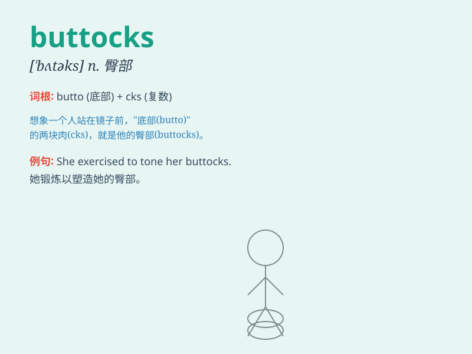

## buttocks

**英音:** _[ˈbʌtəks]_ **美音:** _[ˈbʌtəks]_

**译义:** *n.臀部*

### 短语

+ **bare buttocks:** _光屁股_

+ **firm buttocks:** _结实的臀部_

+ **round buttocks:** _圆润的臀部_

+ **slap the buttocks:** _拍打臀部_

+ **toned buttocks:** _有型的臀部_

### 例句

#### 例句1

> **She hurt her buttocks when she fell off the bike.**

**中文翻译:** 她从自行车上摔下来伤到了臀部。

**单词释义:** 臀部

#### 例句2

> **The doctor examined his patient\'s buttocks carefully.**

**中文翻译:** 医生仔细检查了他病人的臀部。

**单词释义:** 臀部

#### 例句3

> **He sat on the chair, feeling the soreness in his buttocks.**

**中文翻译:** 他坐在椅子上，感觉到臀部酸痛。

**单词释义:** 臀部

### 背诵小故事

>
想象一下，一只调皮的猴子坐在树枝上，不小心往后一滑，正好用它的'buttocks'（臀部）重重地撞到了树干。猴子捂着疼痛的buttocks，一脸的懊恼。

**想象一只猴子因滑落撞到树干，着重描述其臀部，以辅助记忆'buttocks（臀部）'这个单词。**

### 图义

