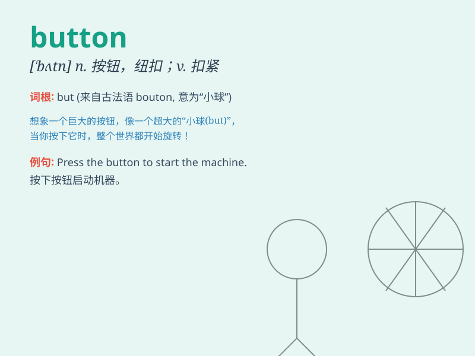

## button

**英音:** _[ˈbʌtn]_ **美音:** _[\'bʌtn]_

**译义:** *n.钮扣,[计]按钮v.扣住,扣紧*

### 短语

+ **push the button:** _按下按钮_

+ **button up:** _扣上扣子_

+ **press button:** _按压按钮_

+ **buttonhole:** _扣眼_

+ **button-down:** _有领扣的_

### 例句

#### 例句1

> **I pushed the button and the door opened.**

**中文翻译:** 我按下按钮，门开了。

**单词释义:** 按钮

#### 例句2

> **She sewed a button onto her coat.**

**中文翻译:** 她在她的外套上缝了一颗纽扣。

**单词释义:** 纽扣

#### 例句3

> **Click the button to start the game.**

**中文翻译:** 点击这个按钮开始游戏。

**单词释义:** 按钮

### 背诵小故事

> One day, Tom was in a hurry to leave the house but couldn\'t find his
jacket. Then he noticed a button on the floor and realized it had fallen
off his jacket. From then on, whenever he saw a button, he remembered
that incident.

**一天，汤姆着急出门却找不到他的夹克。然后他注意到地板上有个纽扣，意识到是从他夹克上掉下来的。从那以后，每当他看到纽扣，就会想起那件事。**

### 图义

