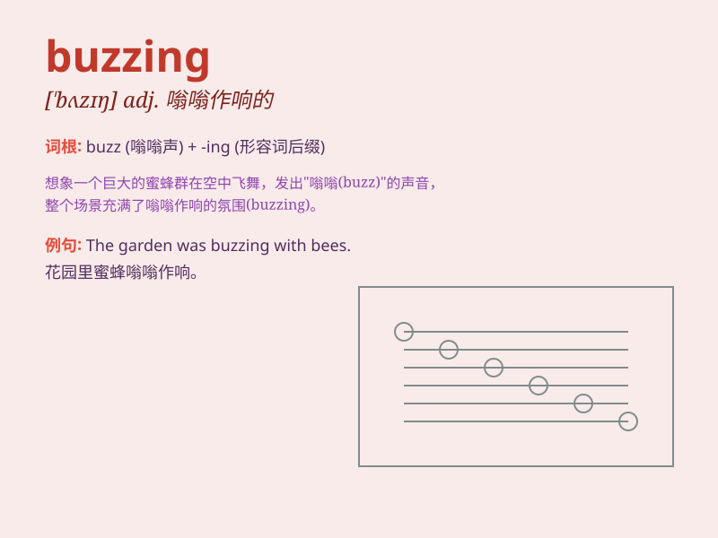

## buzzing

**英音:** _[ˈbʌzɪŋ]_ **美音:** _[ˈbʌzɪŋ]_

**译义:**
*adj.嗡嗡作响的；充满兴奋的；繁忙的；v.发出嗡嗡声；忙乱；活跃（buzz的ing形式）*

### 短语

+ **buzzing bees:** _嗡嗡叫的蜜蜂_

+ **buzzing sound:** _嗡嗡声_

+ **buzzing activity:** _繁忙的活动_

+ **buzzing marketplace:** _热闹的市场_

+ **buzzing neighborhood:** _喧闹的街区_

### 例句

#### 例句1

> **The bees were buzzing around the flowers.**

**中文翻译:** 蜜蜂在花丛周围嗡嗡作响。

**单词释义:** 发出嗡嗡声

#### 例句2

> **The city was buzzing with excitement on the day of the
festival.**

**中文翻译:** 在节日那天，这座城市充满了兴奋的气氛。

**单词释义:** 充满活力；繁忙

#### 例句3

> **The room was buzzing with conversation.**

**中文翻译:** 房间里充满了谈话声。

**单词释义:** 充满嘈杂声

### 背诵小故事

> A bee was buzzing around the flowers. It made a continuous and loud
sound. The buzzing bee attracted a little girl\'s attention. She watched
it with joy.

**一只蜜蜂在花丛周围嗡嗡叫。它发出持续响亮的声音。这只嗡嗡叫的蜜蜂吸引了一个小女孩的注意。她高兴地看着它。**

### 图义

