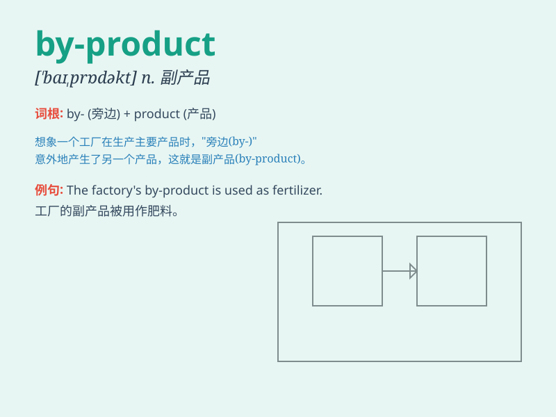

## by-product

**英音:** _[ˈbaɪ prɒdʌkt]_ **美音:** _[ˈbaɪ prɑːdʌkt]_

**译义:** *n.副产品；附带产生的结果*

### 短语

+ **industrial by-product:** _工业副产品_

+ **chemical by-product:** _化学副产品_

+ **unwanted by-product:** _不需要的副产品_

+ **environmental by-product:** _环境副产品_

+ **toxic by-product:** _有毒的副产品_

### 例句

#### 例句1

> **The production of biogas is a by-product of anaerobic
digestion.**

**中文翻译:** 生产沼气是厌氧消化的一个副产品。

**单词释义:** 副产品

#### 例句2

> **Pollution is often a by-product of industrial development.**

**中文翻译:** 污染常常是工业发展的副产品。

**单词释义:** 副产品

#### 例句3

> **The new drug has some beneficial side effects as by-products.**

**中文翻译:** 这种新药有一些有益的副作用作为副产品。

**单词释义:** 副产品

### 背诵小故事

> A factory was making toys. But along with the main toys, some strange
little things were also made. These strange little things were not the
main goal. They were the by-product. Just like unexpected extras.

**一家工厂正在制造玩具。但随着主要的玩具，还生产出了一些奇怪的小东西。这些奇怪的小东西不是主要目标。它们就是副产品。就像意外的附加物。**

### 图义

