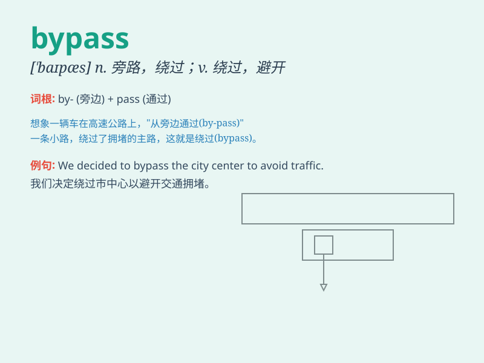

## bypass

**英音:** _[\'baɪpɑːs]_ **美音:** _[\'baɪpæs]_

**译义:** *n.旁路vt.设旁路,迂回*

### 短语

+ **bypass road:** _旁道；旁路_

+ **bypass surgery:** _旁路手术；搭桥手术_

+ **bypass valve:** _旁通阀；旁路阀_

+ **bypass channel:** _旁路通道；迂回通道_

+ **bypass capacitor:** _旁路电容器；去耦电容器_

### 例句

#### 例句1

> **The new road bypasses the town center.**

**中文翻译:** 这条新公路绕过了市中心。

**单词释义:** 绕过；避开

#### 例句2

> **He managed to bypass the security system.**

**中文翻译:** 他设法绕过了安保系统。

**单词释义:** 越过；避开

#### 例句3

> **The doctor suggested a bypass surgery to treat his heart
condition.**

**中文翻译:** 医生建议进行心脏搭桥手术来治疗他的心脏病。

**单词释义:** （给心脏接旁通管的）分流术，搭桥术

### 背诵小故事

> A brave adventurer was on a mission. There was a dangerous road
ahead, but he found a bypass. It was a hidden path that allowed him to
avoid the difficulties and reach his destination safely.

**一位勇敢的冒险家在执行任务。前方道路危险，但他发现了一条旁路。这是一条隐藏的小路，使他得以避开困难，安全到达目的地。**

### 图义

