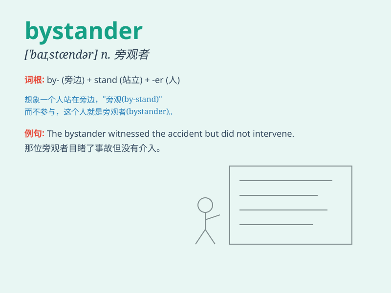

## bystander

**英音:** _[\'baɪstændə]_ **美音:** _[\'baɪstændɚ]_

**译义:** *n.看热闹的人,旁观者*

### 短语

+ **innocent bystander:** _无辜的旁观者_

+ **passive bystander:** _被动的旁观者_

+ **uninvolved bystander:** _未牵涉其中的旁观者_

+ **curious bystander:** _好奇的旁观者_

+ **helpless bystander:** _无助的旁观者_

### 例句

#### 例句1

> **A bystander called the police when he saw the accident.**

**中文翻译:** 一名旁观者在看到事故时报了警。

**单词释义:** 旁观者

#### 例句2

> **The bystanders gathered around to watch the performance.**

**中文翻译:** 旁观者们聚集在周围观看表演。

**单词释义:** 旁观者

#### 例句3

> **Don\'t just be a bystander; offer to help if you can.**

**中文翻译:** 别只是当个旁观者；如果可以的话，主动提供帮助。

**单词释义:** 旁观者

### 背诵小故事

> One day, there was a car accident on the street. A man just stood
there and watched without helping. He was a bystander. Later, people
criticized him for not taking action.

**一天，街上发生了一起车祸。一个男人只是站在那儿看着，没有帮忙。他就是一个旁观者。后来，人们批评他没有采取行动。**

### 图义

