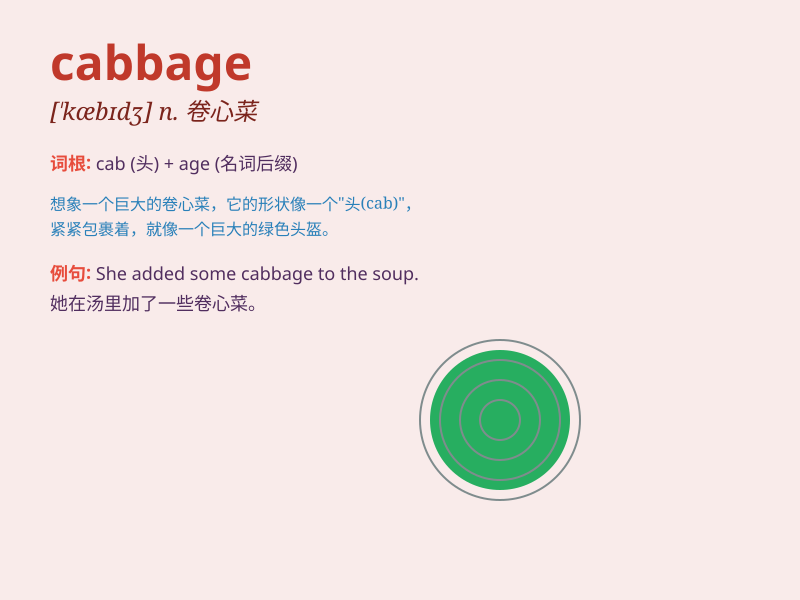

## cabbage

**英音:** _[ˈkæbɪdʒ]_ **美音:** _[ˈkæbɪdʒ]_

**译义:** *n.[植]甘蓝,卷心菜*

### 短语

+ **Chinese cabbage:** _大白菜_

+ **red cabbage:** _紫甘蓝_

+ **cabbage soup:** _卷心菜汤_

+ **cabbage patch:** _卷心菜菜地_

+ **cabbage worm:** _菜青虫_

### 例句

#### 例句1

> **I bought a cabbage from the market.**

**中文翻译:** 我从市场买了一棵卷心菜。

**单词释义:** 卷心菜

#### 例句2

> **The cabbage in the garden is growing well.**

**中文翻译:** 花园里的卷心菜长得很好。

**单词释义:** 卷心菜

#### 例句3

> **She cut up the cabbage to make a salad.**

**中文翻译:** 她把卷心菜切碎做沙拉。

**单词释义:** 卷心菜

### 背诵小故事

> One day, a little rabbit went to the farm and found many green
cabbages. It was so happy because cabbages are its favorite food. The
rabbit ate a big cabbage and felt full and satisfied.

**一天，一只小兔子去农场，发现了好多绿色的卷心菜。它特别开心，因为卷心菜是它最爱的食物。小兔子吃了一个大卷心菜，感到又饱又满足。**

### 图义

