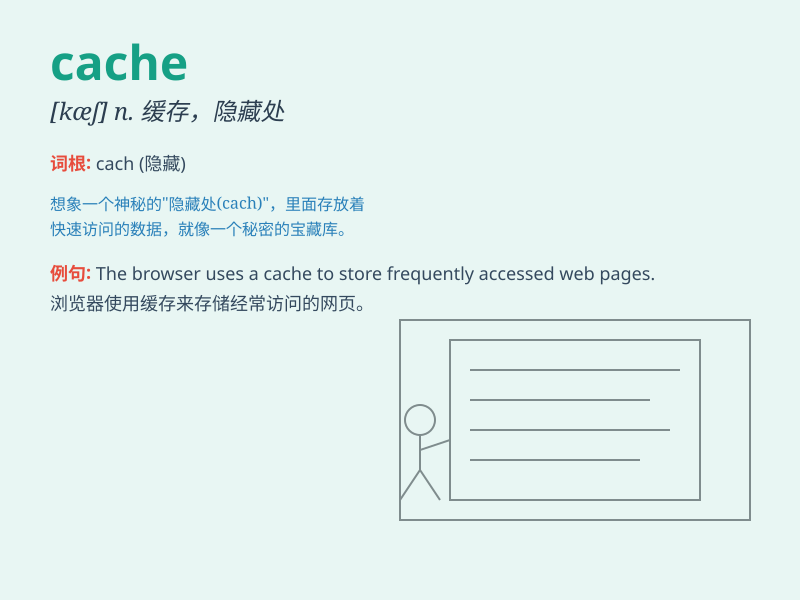

## cache

**英音:** _[kæʃ]_ **美音:** _[kæʃ]_

**译义:**
*n.隐藏处所,隐藏的粮食或物资,贮藏物;vt.隐藏,窖藏;n.高速缓冲存储器*

### 短语

+ **cache memory:** _高速缓冲存储器；快取记忆体_

+ **disk cache:** _磁盘高速缓存_

+ **cache hit:** _高速缓存命中_

+ **cache miss:** _高速缓存未命中_

+ **browser cache:** _浏览器缓存_

### 例句

#### 例句1

> **The computer has a large cache to speed up data access.**

**中文翻译:** 这台电脑有一个大的缓存来加快数据访问。

**单词释义:** 缓存

#### 例句2

> **He hid the treasure in a cache in the forest.**

**中文翻译:** 他把宝藏藏在森林里的一个藏匿处。

**单词释义:** 藏匿处

#### 例句3

> **The browser uses a cache to store frequently visited web
pages.**

**中文翻译:** 浏览器使用缓存来存储经常访问的网页。

**单词释义:** 缓存

### 背诵小故事

> A thief was running away with a bag of treasures. To hide them, he
found a secret cave and used it as a cache. Later, when he wanted to
retrieve the treasures, he remembered exactly where his cache was.

**一个小偷带着一袋财宝逃跑。为了藏起它们，他找到了一个秘密洞穴，并把它当作一个藏匿处。后来，当他想取回财宝时，他清楚地记得他的藏匿处在哪。**

### 图义

