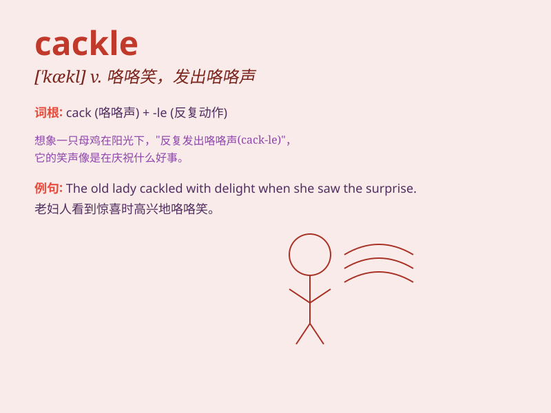

## cackle

**英音:** _[\'kæk(ə)l]_ **美音:** _[\'kækl]_

**译义:** *n.咯咯声,高声笑,饶舌,闲谈vi.咯咯叫,咯咯笑,喋喋不休*

### 短语

+ **cackle laughter:** _咯咯的笑声_

+ **cackle with delight:** _高兴得咯咯笑_

+ **cackle of hens:** _母鸡咯咯叫_

+ **wicked cackle:** _邪恶的咯咯笑_

+ **cackle merrily:** _欢快地咯咯笑_

### 例句

#### 例句1

> **The witches cackled as they cast their spells.**

**中文翻译:** 女巫们在施咒时咯咯地笑。

**单词释义:** 咯咯地笑

#### 例句2

> **The hen cackled loudly when it laid an egg.**

**中文翻译:** 母鸡下蛋时大声咯咯叫。

**单词释义:** 咯咯叫

#### 例句3

> **She cackled with delight at the joke.**

**中文翻译:** 她听到那个笑话高兴得咯咯笑。

**单词释义:** 咯咯地笑

### 背诵小故事

> The witch would cackle loudly every time she cast a spell. Her cackle
was so distinct that it sent shivers down the spines of those nearby.
One day, a brave knight heard the cackle and decided to stop her evil
deeds.

**女巫每次施魔法时都会大声咯咯笑。她的咯咯笑非常独特，让附近的人脊背发凉。有一天，一位勇敢的骑士听到了这咯咯笑，决定阻止她的恶行。**

### 图义

