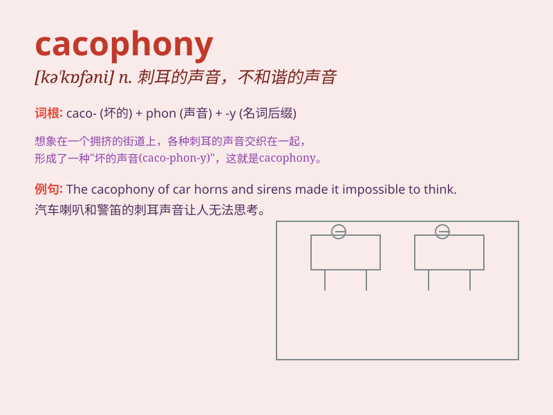

## cacophony

**英音:** _[kə\'kɒf(ə)nɪ]_ **美音:** _[kə\'kɑfəni]_

**译义:** *n.刺耳的音调,不协和音,杂音*

### 短语

+ **a cacophony of voices:** _嘈杂的声音_

+ **cacophony of colours:** _色彩的不和谐_

+ **create a cacophony:** _制造不和谐的声音_

+ **amid the cacophony:** _在嘈杂声中_

+ **the cacophony of traffic:** _交通的嘈杂声_

### 例句

#### 例句1

> **The city street was filled with a cacophony of car horns and
construction noises.**

**中文翻译:** 城市街道充满了汽车喇叭声和建筑噪音的刺耳嘈杂声。

**单词释义:** 刺耳嘈杂的声音

#### 例句2

> **The classroom erupted into a cacophony when the teacher left.**

**中文翻译:** 老师离开时，教室变得一片喧闹嘈杂。

**单词释义:** 喧闹嘈杂声

#### 例句3

> **The music festival turned into a cacophony of different styles
and sounds.**

**中文翻译:** 音乐节变成了各种不同风格和声音的刺耳混音。

**单词释义:** 不和谐的混音

### 背诵小故事

> A group of animals were having a competition. The dog barked loudly,
the cat meowed sharply, and the bird chirped noisily. This mixture of
unpleasant sounds was a perfect example of cacophony.

**一群动物在进行比赛。狗大声地叫，猫尖锐地喵喵叫，鸟嘈杂地叽叽喳喳叫。这种不悦耳声音的混合就是'刺耳嘈杂声'的完美范例。**

### 图义

