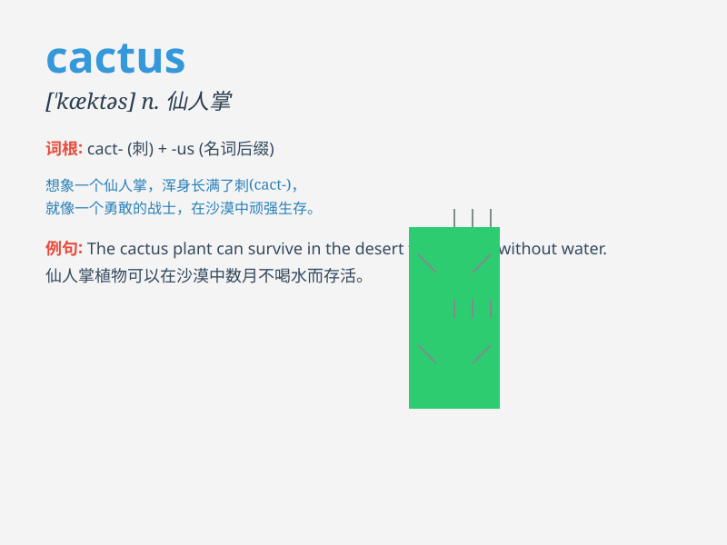

## cactus

**英音:** _[\'kæktəs]_ **美音:** _[\'kæktəs]_

**译义:** *n.[植]仙人掌*

### 短语

+ **prickly cactus:** _多刺的仙人掌_

+ **desert cactus:** _沙漠仙人掌_

+ **ornamental cactus:** _观赏仙人掌_

+ **succulent cactus:** _多汁的仙人掌_

+ **rare cactus:** _珍稀仙人掌_

### 例句

#### 例句1

> **The cactus stood tall and proud in the desert.**

**中文翻译:** 这株仙人掌在沙漠中挺拔而骄傲地矗立着。

**单词释义:** 仙人掌

#### 例句2

> **She carefully watered the cactus on her windowsill.**

**中文翻译:** 她小心地给窗台上的仙人掌浇水。

**单词释义:** 仙人掌

#### 例句3

> **The cactus has sharp spines to protect itself.**

**中文翻译:** 仙人掌有锋利的刺来保护自己。

**单词释义:** 仙人掌

### 背诵小故事

> One day, a little ant was lost in the desert. It was very thirsty and
tired. Suddenly, it saw a cactus. The cactus had sharp thorns but also
juicy flesh inside, which saved the ant. Remember, cactus can be a
savior in the desert!

**有一天，一只小蚂蚁在沙漠中迷路了。它又渴又累。突然，它看到了一棵仙人掌。仙人掌有锋利的刺，但里面也有多汁的果肉，救了这只蚂蚁。记住，仙人掌（cactus）在沙漠中可能是救星！**

### 图义

