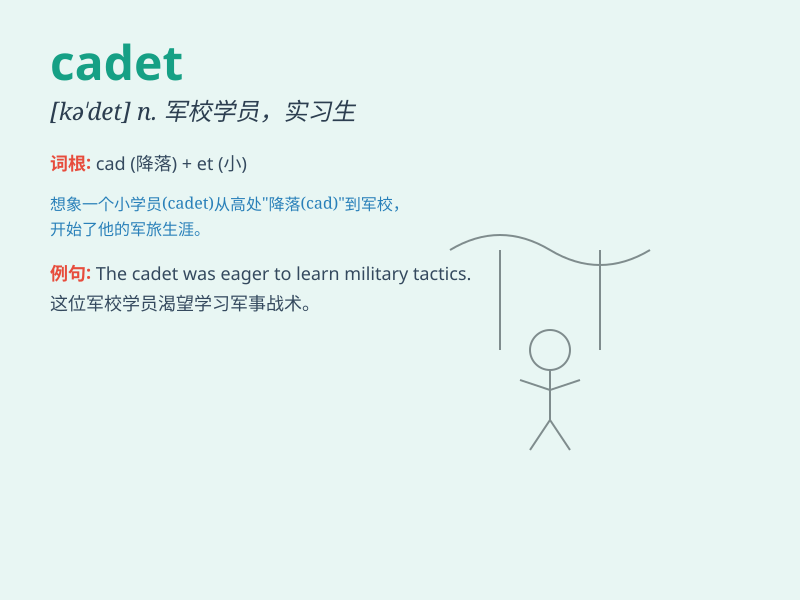

## cadet

**英音:** _[kə\'det]_ **美音:** _[kə\'dɛt]_

**译义:** *n.军官学校学生,\<旧俚>(妓院)拉皮条的人*

### 短语

+ **cadet corps:** _军校学员队_

+ **naval cadet:** _海军学员_

+ **air force cadet:** _空军学员_

+ **cadet officer:** _学员军官_

+ **police cadet:** _警校学员_

### 例句

#### 例句1

> **The cadet was determined to excel in the military training.**

**中文翻译:** 这名军校学员决心在军事训练中表现出色。

**单词释义:** 军校学员

#### 例句2

> **The police cadet received strict discipline and training.**

**中文翻译:** 这位警校学员接受了严格的纪律和训练。

**单词释义:** 警校学员

#### 例句3

> **The cadet showed great courage during the emergency drill.**

**中文翻译:** 在紧急演练中，这名学员表现出了极大的勇气。

**单词释义:** 学员

### 背诵小故事

> 有个年轻人梦想成为军人，他加入了军校，成为了一名
cadet（军校学员）。他努力训练，学习知识，期待有一天能为国家效力。这个
cadet 不畏困难，勇敢前行。

**有个年轻人梦想成为军人，他加入了军校，成为了一名军校学员。他努力训练，学习知识，期待有一天能为国家效力。这个军校学员不畏困难，勇敢前行。**

### 图义

