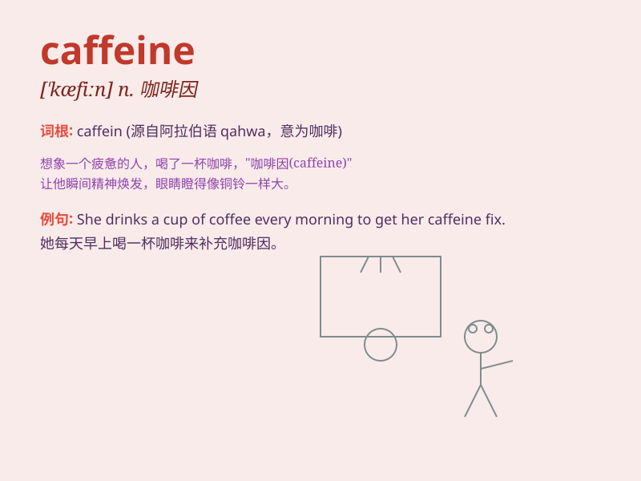

## caffeine

**英音:** _[\'kæfiːn]_ **美音:** _[\'kæfin]_

**译义:** *n.咖啡因,茶精(兴奋剂)*

### 短语

+ **caffeine addiction:** _咖啡因成瘾_

+ **caffeine content:** _咖啡因含量_

+ **caffeine intake:** _咖啡因摄入量_

+ **caffeine boost:** _咖啡因提神_

+ **caffeine effect:** _咖啡因作用_

### 例句

#### 例句1

> **I try to limit my caffeine intake to avoid sleep problems.**

**中文翻译:** 我尽量限制咖啡因的摄入量以避免睡眠问题。

**单词释义:** 咖啡因

#### 例句2

> **This energy drink contains a high amount of caffeine.**

**中文翻译:** 这种能量饮料含有大量的咖啡因。

**单词释义:** 咖啡因

#### 例句3

> **She\'s sensitive to caffeine and gets jittery when she drinks
coffee.**

**中文翻译:** 她对咖啡因敏感，喝咖啡时会感到紧张不安。

**单词释义:** 咖啡因

### 背诵小故事

> One day, Tom was very tired. But after drinking a cup of coffee
containing caffeine, he became energetic. Caffeine is like a magic power
that wakes us up and boosts our spirit.

**有一天，汤姆非常疲倦。但在喝了一杯含有咖啡因的咖啡后，他变得精力充沛。咖啡因就像一种神奇的力量，能唤醒我们并提升我们的精神。**

### 图义

