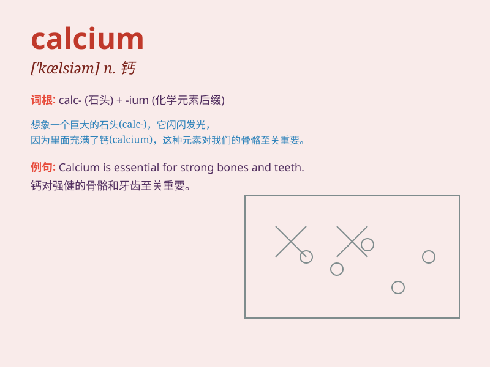

## calcium

**英音:** _[\'kælsɪəm]_ **美音:** _[\'kælsɪəm]_

**译义:** *n.[化]钙(元素符号Ca)*

### 短语

+ **calcium carbonate:** _碳酸钙_

+ **calcium deficiency:** _缺钙；钙缺乏_

+ **calcium intake:** _钙摄入量_

+ **calcium supplement:** _钙补充剂_

+ **calcium channel:** _钙通道_

### 例句

#### 例句1

> **Calcium is essential for strong bones and teeth.**

**中文翻译:** 钙对于强健骨骼和牙齿至关重要。

**单词释义:** 钙（一种化学元素）

#### 例句2

> **Milk is a good source of calcium.**

**中文翻译:** 牛奶是钙的良好来源。

**单词释义:** 钙（一种营养成分）

#### 例句3

> **Some people take calcium supplements to meet their daily
requirements.**

**中文翻译:** 有些人服用钙补充剂来满足日常需求。

**单词释义:** 钙（物质名词）

### 背诵小故事

> One day, a little scientist was doing an experiment. He needed
calcium to make a special potion. He found calcium in milk and cheese.
With it, his experiment was a great success!

**有一天，一位小科学家在做实验。他需要钙来制作一种特殊的药剂。他在牛奶和奶酪中找到了钙。有了钙，他的实验取得了巨大成功！**

### 图义

