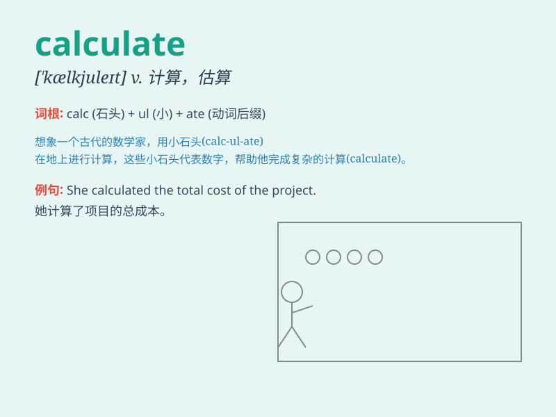

## calculate

**英音:** _[\'kælkjʊleɪt]_ **美音:** _[\'kælkjulet]_

**译义:** *v.计算,考虑,计划,打算v.\<美>以为,认为*

### 短语

+ **calculate the cost:** _计算成本_

+ **calculate accurately:** _精确计算_

+ **calculate mentally:** _心算_

+ **calculate the distance:** _计算距离_

+ **calculate the probability:** _计算概率_

### 例句

#### 例句1

> **We need to calculate the cost of the project carefully.**

**中文翻译:** 我们需要仔细计算该项目的成本。

**单词释义:** 计算

#### 例句2

> **It\'s difficult to calculate the damage caused by the storm.**

**中文翻译:** 风暴造成的损失很难计算。

**单词释义:** 计算

#### 例句3

> **The scientist is trying to calculate the speed of light.**

**中文翻译:** 这位科学家正在尝试计算光速。

**单词释义:** 计算

### 背诵小故事

> A smart detective was trying to solve a mystery. He needed to
calculate the exact time the crime happened. He used all the clues and
his math skills to find the answer. Finally, he succeeded!

**一位聪明的侦探正在试图解开一个谜团。他需要计算犯罪发生的确切时间。他利用所有的线索和他的数学技能来找到答案。最后，他成功了！**

### 图义

