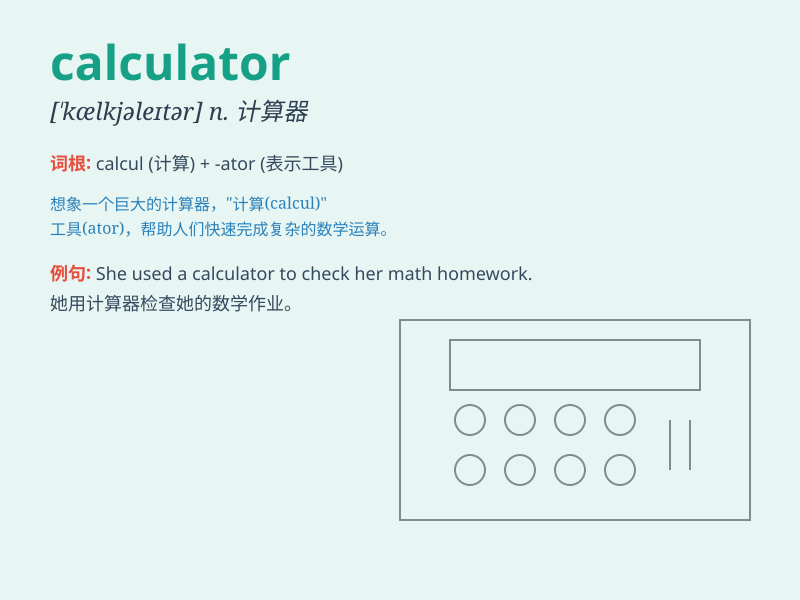

## calculator

**英音:** _[\'kælkjʊleɪtə]_ **美音:** _[\'kælkjuletɚ]_

**译义:** *n.计算机,计算器*

### 短语

+ **electronic calculator:** _电子计算器_

+ **pocket calculator:** _袖珍计算器_

+ **scientific calculator:** _科学计算器_

+ **graphing calculator:** _图形计算器_

+ **programmable calculator:** _可编程计算器_

### 例句

#### 例句1

> **I need a calculator to solve this math problem.**

**中文翻译:** 我需要一个计算器来解决这个数学问题。

**单词释义:** 计算器

#### 例句2

> **The calculator on my desk is not working properly.**

**中文翻译:** 我桌上的计算器不能正常工作。

**单词释义:** 计算器

#### 例句3

> **She used a calculator to calculate the total cost.**

**中文翻译:** 她用计算器计算了总成本。

**单词释义:** 计算器

### 背诵小故事

> One day, Tom was doing math homework and was stuck. His friend gave
him a calculator. With it, Tom could quickly calculate the answers and
finish his homework. The calculator became his helpful tool.

**有一天，汤姆在做数学作业时被难住了。他的朋友给了他一个计算器。有了它，汤姆能快速算出答案并完成作业。计算器成了他有用的工具。**

### 图义

