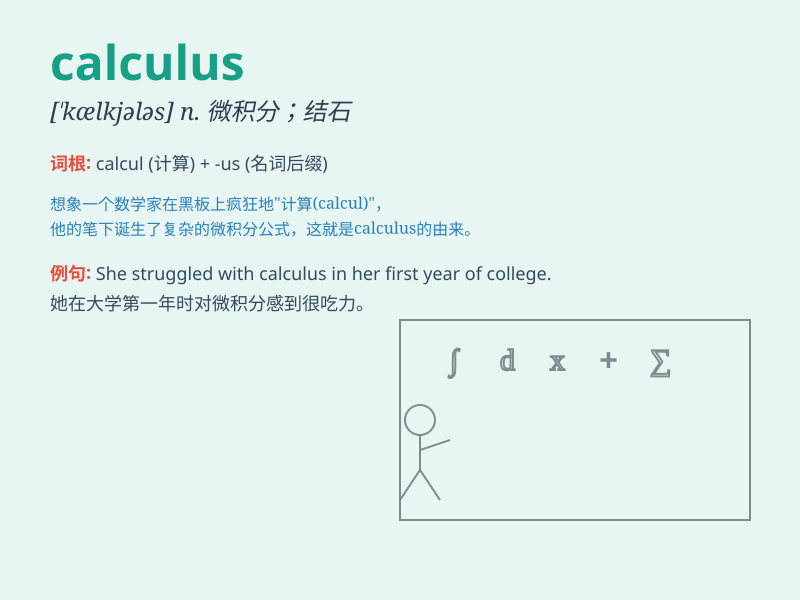

## calculus

**英音:** _[\'kælkjʊləs]_ **美音:** _[\'kælkjələs]_

**译义:** *n.微积分学,结石*

### 短语

+ **differential calculus:** _微分学_

+ **integral calculus:** _积分学_

+ **vector calculus:** _向量微积分_

+ **infinitesimal calculus:** _无穷小量微积分_

+ **multivariable calculus:** _多变量微积分_

### 例句

#### 例句1

> **The doctor explained the calculus in my kidney to me.**

**中文翻译:** 医生向我解释了我肾结石的情况。

**单词释义:** 结石

#### 例句2

> **Mathematical calculus is a challenging subject for many
students.**

**中文翻译:** 对于许多学生来说，数学微积分是一门具有挑战性的学科。

**单词释义:** 微积分

#### 例句3

> **The calculus of probability is used in various fields of
science.**

**中文翻译:** 概率计算应用于各个科学领域。

**单词释义:** 计算

### 背诵小故事

>
想象一个天才数学家，每天都在纸上计算无数的算式。这些算式就像石头，堆积起来形成了一门学问，这门学问就叫
calculus。它代表着数学中的微积分，是解决复杂问题的有力工具。

**想象一位天才数学家通过计算算式形成微积分这门学问，来辅助记忆单词\'calculus\'（微积分）**

### 图义

