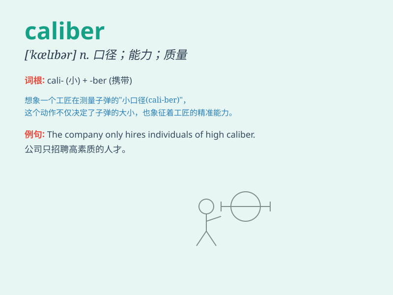

## caliber

**英音:** _[ˈkælɪbə]_ **美音:** _[ˈkæləbər]_

**译义:** *n.口径,才干,器量*

### 短语

+ **high caliber:** _高质量；高水准_

+ **caliber of person:** _人的才干；人的素质_

+ **caliber of weapon:** _武器的口径_

+ **small caliber:** _小口径_

+ **caliber measurement:** _口径测量_

### 例句

#### 例句1

> **The caliber of this athlete is exceptional. **

**中文翻译:** 这位运动员的水平非常出色。

**单词释义:** 水平；能力

#### 例句2

> **The gun is of high caliber. **

**中文翻译:** 这把枪的口径很大。

**单词释义:** 口径

#### 例句3

> **We need people of caliber to lead the project. **

**中文翻译:** 我们需要有能力的人来领导这个项目。

**单词释义:** 能力；才干

### 背诵小故事

> A detective was looking for a criminal. The only clue was the caliber
of the bullet. It was a special caliber, which helped the detective
catch the bad guy in the end.

**一位侦探正在寻找一名罪犯。唯一的线索是子弹的口径。这是一种特殊的口径，最终帮助侦探抓住了坏人。**

### 图义

