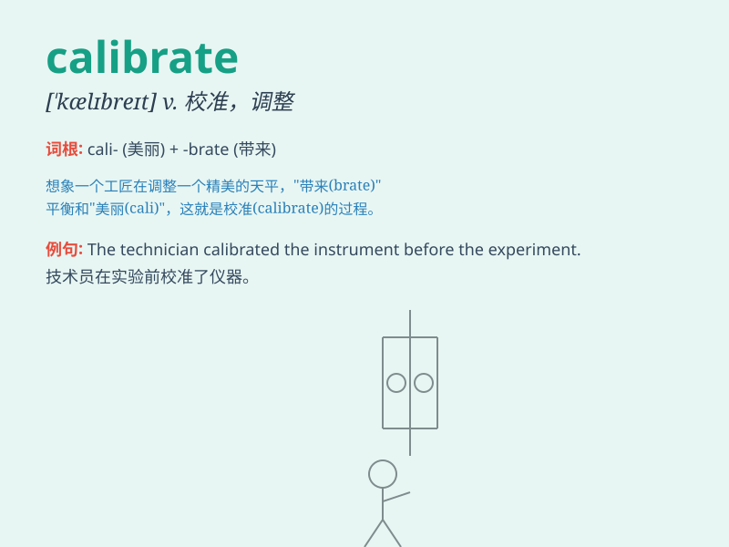

## calibrate

**英音:** _[\'kælɪbreɪt]_ **美音:** _[\'kælɪbret]_

**译义:** *v.校准*

### 短语

+ **calibrate the instrument:** _校准仪器_

+ **calibrate accurately:** _精确校准_

+ **calibrate frequently:** _经常校准_

+ **calibrate manually:** _手动校准_

+ **calibrate precisely:** _精准校准_

### 例句

#### 例句1

> **The engineer calibrated the instrument to ensure accurate
measurements.**

**中文翻译:** 工程师校准了仪器以确保测量准确。

**单词释义:** 校准

#### 例句2

> **You need to calibrate the scale before weighing the
ingredients.**

**中文翻译:** 在称配料之前，你需要校准秤。

**单词释义:** 校准

#### 例句3

> **The camera was calibrated for optimal image quality.**

**中文翻译:** 这台相机经过校准以达到最佳图像质量。

**单词释义:** 校准

### 背诵小故事

> Imagine a scientist working in a laboratory. He has a special tool
and he needs to calibrate it precisely to get accurate results. Just
like that, \'calibrate\' means to adjust and make exact.

**想象一位科学家在实验室工作。他有一个特殊的工具，需要精确校准它以获得准确的结果。就像这样，'calibrate'意思是校准、调整使其精确。**

### 图义

