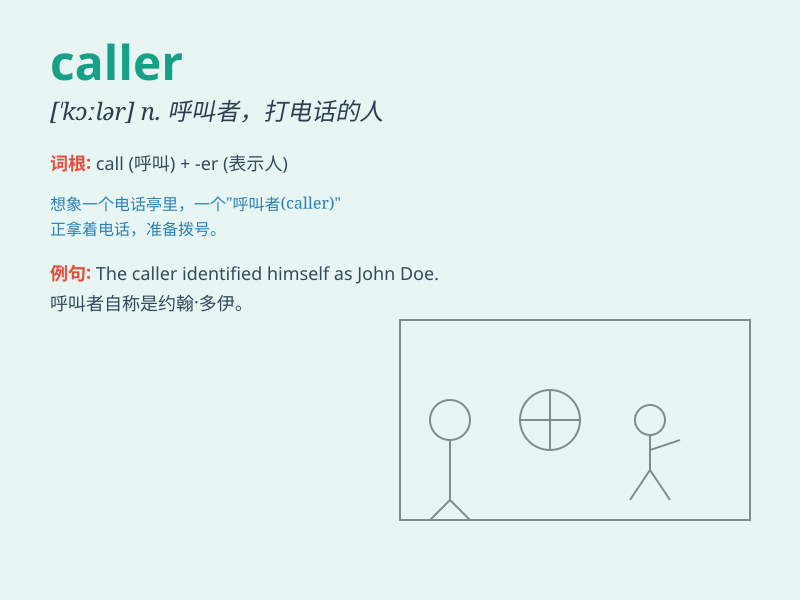

## caller

**英音:** _[\'kɔːlə]_ **美音:** _[\'kɔlɚ]_

**译义:** *n.呼叫者,传唤员,访客,召集员adj.新鲜的*

### 短语

+ **anonymous caller:** _匿名来电者_

+ **regular caller:** _常客；经常打电话的人_

+ **telephone caller:** _电话来电者_

+ **unwanted caller:** _不受欢迎的来电者_

+ **frequent caller:** _频繁来电者_

### 例句

#### 例句1

> **The caller asked for your phone number.**

**中文翻译:** 来电者询问了你的电话号码。

**单词释义:** 打电话的人；来访者

#### 例句2

> **The radio show received many calls from angry callers.**

**中文翻译:** 这个广播节目接到了许多愤怒听众的来电。

**单词释义:** 打电话者；呼叫者

#### 例句3

> **The caller at the door was selling insurance.**

**中文翻译:** 门口的来访者是卖保险的。

**单词释义:** 来访者；上门的人

### 背诵小故事

> One day, when I was at home, the phone rang. I picked it up and heard
a voice. The person speaking was the caller. He needed some help and I
tried my best to assist him.

**有一天，我在家时电话响了。我接起来听到一个声音。说话的这个人就是来电者。他需要一些帮助，我尽力协助了他。**

### 图义

