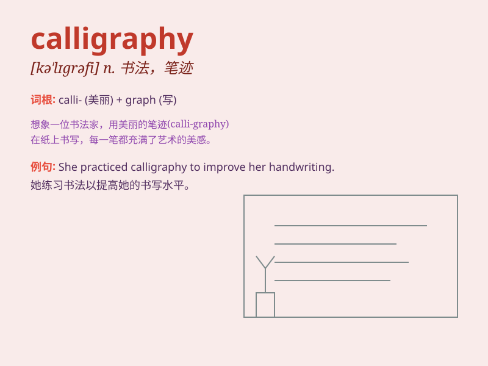

## calligraphy

**英音:** _[kə\'lɪgrəfɪ]_ **美音:** _[kə\'lɪɡrəfi]_

**译义:** *n.书法*

### 短语

+ **Chinese calligraphy:** _中国书法_

+ **artistic calligraphy:** _艺术书法_

+ **modern calligraphy:** _现代书法_

+ **calligraphy exhibition:** _书法展览_

+ **master of calligraphy:** _书法大师_

### 例句

#### 例句1

> **She has mastered the art of calligraphy and her works are highly
praised.**

**中文翻译:** 她精通书法艺术，其作品备受赞誉。

**单词释义:** 书法

#### 例句2

> **The museum showcases a collection of ancient calligraphy.**

**中文翻译:** 博物馆展示了古代书法收藏。

**单词释义:** 书法

#### 例句3

> **He spends hours practicing calligraphy every day to improve his
skills.**

**中文翻译:** 他每天花几个小时练习书法来提高自己的技巧。

**单词释义:** 书法

### 背诵小故事

> One day, Alice was lost in a magical forest. A wise old owl appeared
and showed her beautiful writings on tree trunks. Alice was amazed and
asked what it was. The owl said, \'This is calligraphy, the art of
beautiful writing.\'

**有一天，爱丽丝在一个神奇的森林里迷路了。一只聪明的老猫头鹰出现，并给她展示了树干上美丽的文字。爱丽丝很惊讶并问这是什么。猫头鹰说：'这是书法，优美书写的艺术。'**

### 图义

