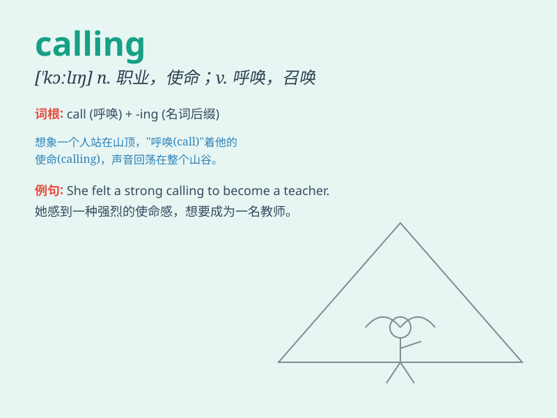

## calling

**英音:** _[\'kɔːlɪŋ]_ **美音:** _[\'kɔlɪŋ]_

**译义:** *n.职业,行业,邀请,点名,召集*

### 短语

+ **calling card:** _名片；（某人或某事的）标志，特色_

+ **calling off:** _取消；叫走_

+ **calling out:** _大声呼喊；唤起_

+ **sense of calling:** _使命感；职业使命感_

+ **noble calling:** _崇高使命；高尚职业_

### 例句

#### 例句1

> **She felt a strong calling to become a doctor and help others.**

**中文翻译:** 她感受到了成为一名医生并帮助他人的强烈召唤。

**单词释义:** 使命感；天职

#### 例句2

> **Teaching is not just a job for him; it\'s his calling.**

**中文翻译:** 教学对他来说不仅仅是一份工作；这是他的召唤。

**单词释义:** 使命；职业

#### 例句3

> **The bird\'s calling could be heard from far away.**

**中文翻译:** 鸟儿的叫声从很远的地方就能听见。

**单词释义:** 叫声

### 背诵小故事

> One day, Tom was lost in a forest. He felt a strong calling from deep
inside to find the way out. He followed that inner voice and finally
reached safety. The calling was like a guiding light for him.

**有一天，汤姆在森林里迷路了。他内心深处感受到一种强烈的召唤，要找到出路。他听从了那个内心的声音，最终到达了安全地带。这个召唤对他来说就像一盏指路明灯。**

### 图义

