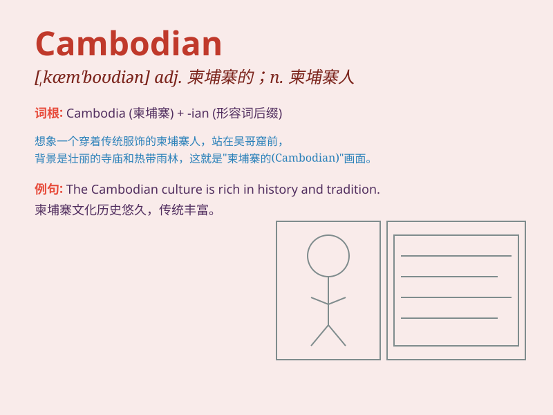

## Cambodian

**英音:** _[kæmˈbəʊdiən]_ **美音:** _[kæmˈboʊdiən]_

**译义:** *adj.柬埔寨的;柬埔寨人的;柬埔寨语的 n.柬埔寨人;柬埔寨语*

### 短语

+ **Cambodian culture:** _柬埔寨文化_

+ **Cambodian people:** _柬埔寨人民_

+ **Cambodian language:** _柬埔寨语_

+ **Cambodian history:** _柬埔寨历史_

+ **Cambodian cuisine:** _柬埔寨美食_

### 例句

#### 例句1

> **The Cambodian culture is rich and diverse.**

**中文翻译:** 柬埔寨文化丰富多样。

**单词释义:** 柬埔寨的；柬埔寨人的；柬埔寨语的

#### 例句2

> **She is married to a Cambodian man.**

**中文翻译:** 她嫁给了一位柬埔寨男人。

**单词释义:** 柬埔寨的；柬埔寨人的；柬埔寨语的

#### 例句3

> **I\'m interested in Cambodian history.**

**中文翻译:** 我对柬埔寨历史感兴趣。

**单词释义:** 柬埔寨的；柬埔寨人的；柬埔寨语的

### 背诵小故事

> Once upon a time, I met a friendly Cambodian in a foreign land. He
wore traditional clothes and introduced his beautiful country. I\'ll
never forget that encounter.

**从前，在异国他乡我遇到了一位友好的柬埔寨人。他穿着传统服装，并介绍了他美丽的国家。我永远不会忘记那次相遇。**

### 图义

