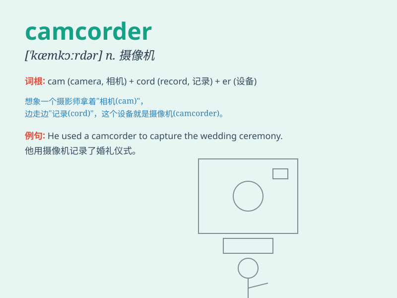

## camcorder

**英音:** _[\'kæmkɔːdə]_ **美音:** _[\'kæm\'kɔrdɚ]_

**译义:** * 可携式摄像机*

### 短语

+ **digital camcorder:** _数码摄像机_

+ **handheld camcorder:** _手持式摄像机_

+ **professional camcorder:** _专业摄像机_

+ **portable camcorder:** _便携式摄像机_

+ **high-definition camcorder:** _高清摄像机_

### 例句

#### 例句1

> **I used the camcorder to record the wedding ceremony.**

**中文翻译:** 我用摄像机记录了婚礼仪式。

**单词释义:** 摄像机

#### 例句2

> **He bought a new camcorder for his vacation trip.**

**中文翻译:** 他为假期旅行买了一台新摄像机。

**单词释义:** 摄像机

#### 例句3

> **The camcorder captured every precious moment of the party.**

**中文翻译:** 摄像机记录下了聚会的每一个珍贵瞬间。

**单词释义:** 摄像机

### 背诵小故事

> One day, I went on a trip and carried a \'camcorder\' to record every
beautiful moment. The \'camcorder\' was like my magic box that captured
memories. With it, I could relive the joy of the journey anytime.

**有一天，我去旅行并携带了一台'摄像机'来记录每一个美好的时刻。这台'摄像机'就像我的魔法盒子，捕捉了回忆。有了它，我随时都能重温旅途的快乐。**

### 图义

