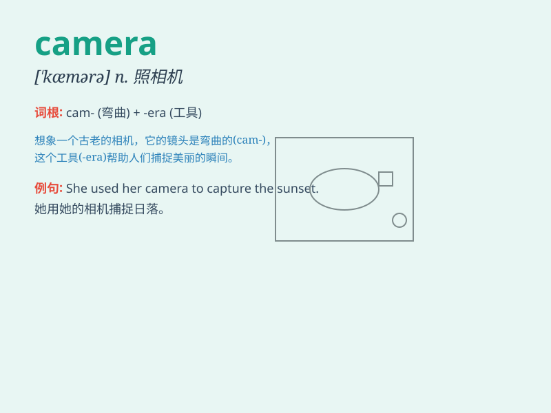

## camera

**英音:** _[\'kæm(ə)rə]_ **美音:** _[\'kæmərə]_

**译义:** *n.照相机*

### 短语

+ **digital camera:** _数码相机_

+ **video camera:** _摄像机_

+ **camera lens:** _相机镜头_

+ **camera crew:** _摄影组；摄制组_

+ **camera angle:** _拍摄角度_

### 例句

#### 例句1

> **I took some beautiful pictures with my new camera.**

**中文翻译:** 我用我的新相机拍了一些漂亮的照片。

**单词释义:** 相机

#### 例句2

> **The thief stole the expensive camera from the store.**

**中文翻译:** 小偷从商店偷走了那台昂贵的相机。

**单词释义:** 相机

#### 例句3

> **She always carries a small camera when she travels.**

**中文翻译:** 当她旅行时，她总是带着一个小相机。

**单词释义:** 相机

### 背诵小故事

> One day, I went on a trip and wanted to record every beautiful
moment. So, I took out my CAMERA and clicked away. With it, I captured
the blue sky, the green grass, and the smiling faces. The CAMERA became
my best friend on this journey.

**有一天，我去旅行，想要记录每一个美好的瞬间。于是，我拿出我的相机不停地按快门。用它，我捕捉到了蓝天、绿草和笑脸。相机在这次旅行中成为了我最好的朋友。**

### 图义

