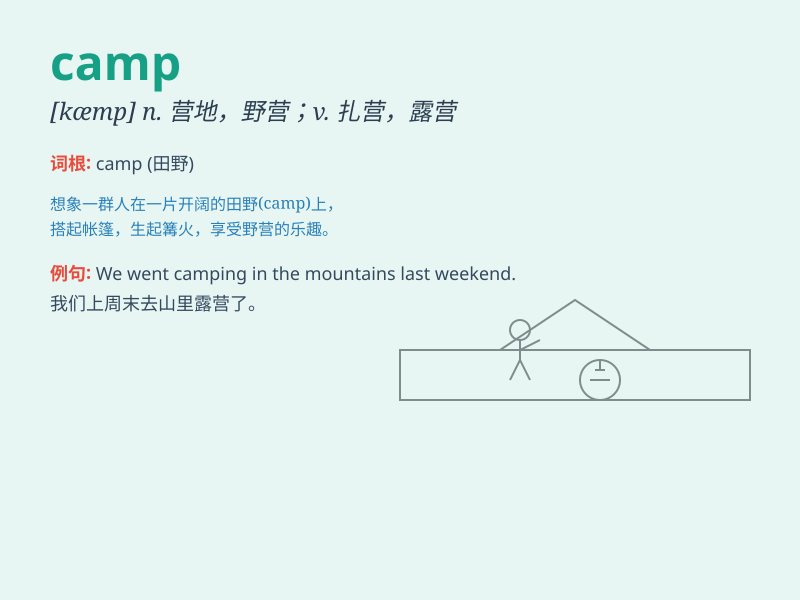

## camp

**英音:** _[kæmp]_ **美音:** _[kæmp]_

**译义:** *n.露营地,阵营vi.露营,扎营*

### 短语

+ **summer camp:** _夏令营_

+ **camp site:** _营地_

+ **refugee camp:** _难民营_

+ **camp out:** _露营_

+ **training camp:** _训练营_

### 例句

#### 例句1

> **We went camping in the mountains last weekend.**

**中文翻译:** 上周末我们去山里露营。

**单词释义:** 露营；宿营

#### 例句2

> **The soldiers set up a camp near the river.**

**中文翻译:** 士兵们在河边扎营。

**单词释义:** 营地；兵营

#### 例句3

> **He has been in the political camp for many years.**

**中文翻译:** 他已在政治阵营中混迹多年。

**单词释义:** 阵营；派别

### 背诵小故事

> A group of friends decided to go on an adventure. They carried their
tents and food to a beautiful forest and set up a camp. They had a great
time singing and dancing around the campfire at night.

**一群朋友决定去冒险。他们带着帐篷和食物来到一片美丽的森林，并搭建了一个营地。晚上他们围在篝火旁唱歌跳舞，玩得很开心。**

### 图义

