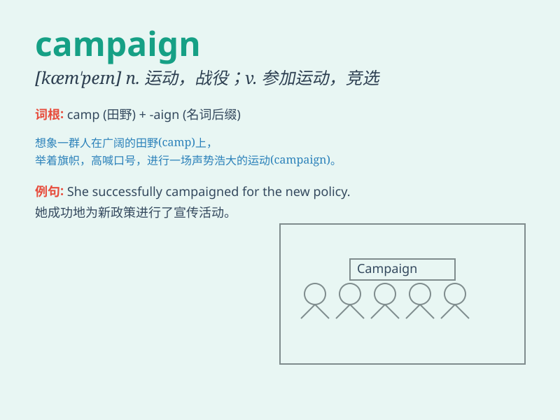

## campaign

**英音:** _[kæm\'peɪn]_ **美音:** _[kæm\'pen]_

**译义:**
*n.[军]战役,(政治或商业性)活动,竞选运动vi.参加活动,从事活动,作战*

### 短语

+ **political campaign:** _政治运动_

+ **advertising campaign:** _广告宣传活动_

+ **military campaign:** _军事战役_

+ **sales campaign:** _促销活动_

+ **charity campaign:** _慈善活动_

### 例句

#### 例句1

> **The politician launched a successful campaign to win the
election.**

**中文翻译:** 这位政治家发起了一场成功的竞选活动以赢得选举。

**单词释义:** 竞选活动

#### 例句2

> **The company is running a marketing campaign to promote its new
product.**

**中文翻译:** 该公司正在开展营销活动来推广其新产品。

**单词释义:** 活动；运动

#### 例句3

> **The military campaign lasted for several months.**

**中文翻译:** 军事行动持续了几个月。

**单词释义:** 战役；作战

### 背诵小故事

> A brave general led his soldiers on a long campaign. They crossed
mountains and rivers, facing many challenges. But with unity and
courage, they finally achieved victory. The campaign made them heroes.

**一位勇敢的将军率领他的士兵进行了一场漫长的战役。他们翻山越岭，面临诸多挑战。但凭借团结和勇气，他们最终取得了胜利。这场战役让他们成为了英雄。**

### 图义

