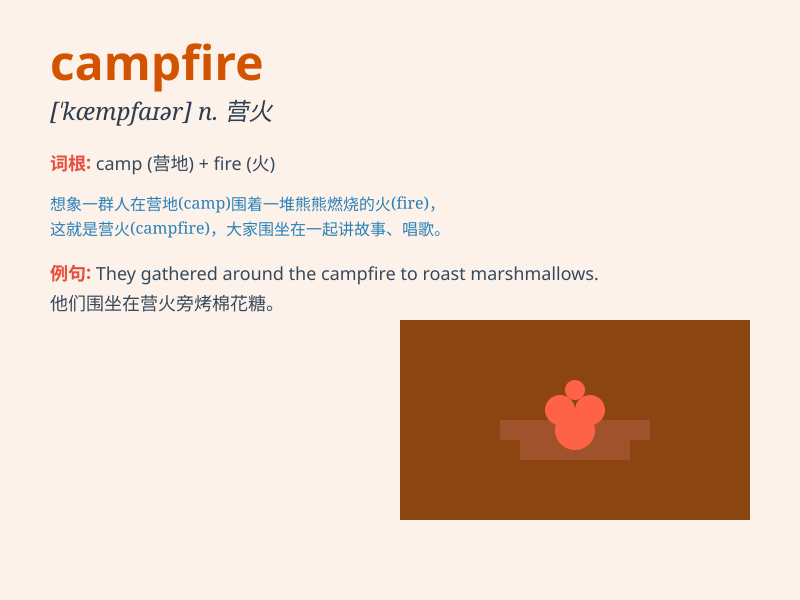

## campfire

**英音:** _[\'kæmpfaɪə]_ **美音:** _[\'kæmpfaɪɚ]_

**译义:** *n.营火,营火会*

### 短语

+ **light a campfire:** _点燃篝火_

+ **sit around the campfire:** _围坐在篝火旁_

+ **make a campfire:** _生篝火_

+ **put out the campfire:** _扑灭篝火_

+ **enjoy the campfire:** _享受篝火_

### 例句

#### 例句1

> **We sat around the campfire and told stories.**

**中文翻译:** 我们围坐在篝火旁，讲故事。

**单词释义:** 篝火

#### 例句2

> **The campfire provided warmth on the cold night.**

**中文翻译:** 篝火在寒冷的夜晚提供了温暖。

**单词释义:** 篝火

#### 例句3

> **They gathered wood to build a campfire.**

**中文翻译:** 他们收集木材来生篝火。

**单词释义:** 篝火

### 背诵小故事

> One night, while camping in the forest, we gathered around a
campfire. The flames danced, giving us warmth and light. We shared
stories and roasted marshmallows. The campfire was the heart of our
happy night.

**一天晚上，在森林里露营时，我们围坐在篝火旁。火焰舞动着，给我们带来温暖和光明。我们分享故事，烤棉花糖。篝火是我们快乐夜晚的核心。**

### 图义

