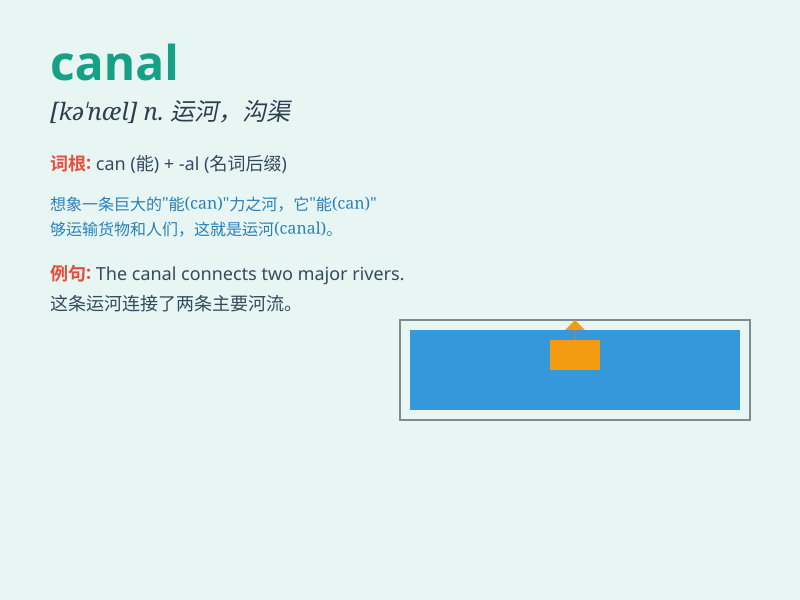

## canal

**英音:** _[kə\'næl]_ **美音:** _[kə\'næl]_

**译义:** *n.运河,小道,导管,槽,沟渠vt.开运河*

### 短语

+ **canal boat:** _运河船_

+ **canal system:** _运河系统_

+ **navigable canal:** _通航运河_

+ **irrigation canal:** _灌溉渠道_

+ **canal engineering:** _运河工程_

### 例句

#### 例句1

> **The Panama Canal is an important waterway for international
trade.**

**中文翻译:** 巴拿马运河是国际贸易的重要航道。

**单词释义:** 运河

#### 例句2

> **The doctor inserted a tube into the patient\'s nasal canal.**

**中文翻译:** 医生将一根管子插入病人的鼻道。

**单词释义:** 管，道

#### 例句3

> **The irrigation canal brought water to the fields.**

**中文翻译:** 灌溉渠把水引到了田里。

**单词释义:** 渠道

### 背诵小故事

> A little mouse was lost in a big factory. It found a canal and
followed it, hoping to find a way out. Finally, it saw light at the end
of the canal and escaped. The canal was like a savior for the mouse.

**一只小老鼠在一个大工厂里迷路了。它发现了一条运河然后沿着它走，希望能找到出路。最后，它在运河的尽头看到了光然后逃走了。这条运河对于老鼠来说就像救星一样。**

### 图义

