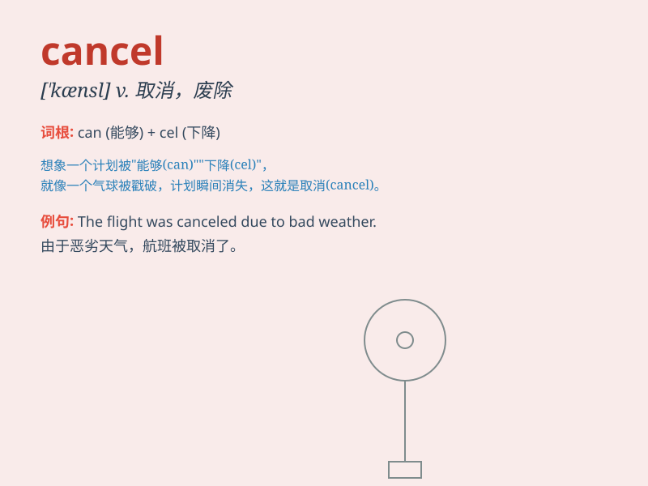

## cancel

**英音:** _[\'kæns(ə)l]_ **美音:** _[\'kænsl]_

**译义:** *vt.取消,删去*

### 短语

+ **cancel out:** _抵消；消除_

+ **cancel an order:** _取消订单_

+ **cancel a meeting:** _取消会议_

+ **cancel a subscription:** _取消订阅_

+ **cancel a ticket:** _退票_

### 例句

#### 例句1

> **I had to cancel my trip due to bad weather.**

**中文翻译:** 由于天气不好，我不得不取消我的旅行。

**单词释义:** 取消

#### 例句2

> **The concert was cancelled because of the singer\'s illness.**

**中文翻译:** 这场音乐会因为歌手生病被取消了。

**单词释义:** 取消

#### 例句3

> **Please cancel the reservation for me.**

**中文翻译:** 请为我取消预订。

**单词释义:** 取消

### 背诵小故事

> One day, I booked a flight but had to change my plan. So, I called
the airline to cancel the reservation. It was a bit troublesome, but
finally, the cancelation was done successfully.

**有一天，我预订了一趟航班，但不得不改变计划。所以，我打电话给航空公司取消预订。这有点麻烦，但最终取消成功了。**

### 图义

