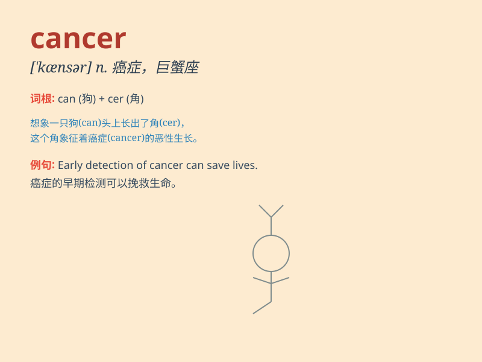

## cancer

**英音:** _[\'kænsə]_ **美音:** _[\'kænsɚ]_

**译义:** *n.癌,毒瘤*

### 短语

+ **breast cancer:** _乳腺癌_

+ **lung cancer:** _肺癌_

+ **skin cancer:** _皮肤癌_

+ **stomach cancer:** _胃癌_

+ **colon cancer:** _结肠癌_

### 例句

#### 例句1

> **Smoking is a major cause of cancer.**

**中文翻译:** 吸烟是癌症的一个主要成因。

**单词释义:** 癌症

#### 例句2

> **She was diagnosed with breast cancer last year.**

**中文翻译:** 她去年被诊断出患有乳腺癌。

**单词释义:** 癌症

#### 例句3

> **The doctor is researching a new treatment for cancer.**

**中文翻译:** 这位医生正在研究一种新的癌症治疗方法。

**单词释义:** 癌症

### 背诵小故事

> A crab was walking along the beach, but it was very strange. Its body
was full of ugly lumps. People said it looked like CANCER. Later, they
used this word to describe a serious disease with abnormal cell growth.

**一只螃蟹在海滩上走着，但它很奇怪。它的身体长满了难看的肿块。人们说它看起来像"癌症"。后来，他们就用这个词来形容细胞异常生长的严重疾病。**

### 图义

