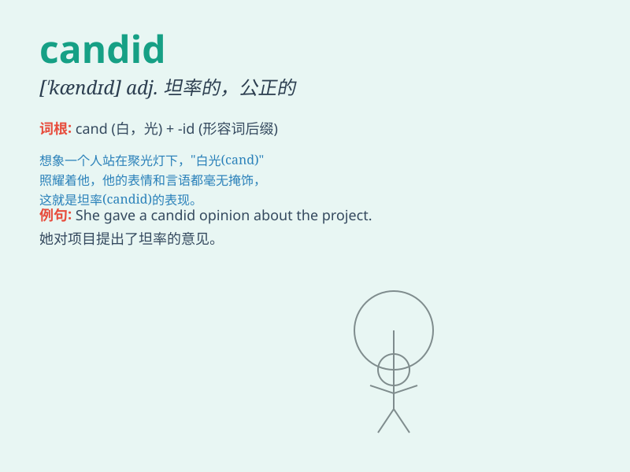

## candid

**英音:** _[\'kændɪd]_ **美音:** _[\'kændɪd]_

**译义:** *adj.无偏见的,公正的,坦白的,率直的*

### 短语

+ **candid photo:** _抓拍的照片；偷拍的照片_

+ **candid opinion:** _坦率的意见_

+ **candid conversation:** _坦诚的交谈_

+ **candid statement:** _直言不讳的声明_

+ **candid report:** _公正的报道_

### 例句

#### 例句1

> **She gave a candid assessment of the situation.**

**中文翻译:** 她对形势作出了坦率的评估。

**单词释义:** 坦率的；直言不讳的

#### 例句2

> **The photographer captured candid moments of the children at
play.**

**中文翻译:** 摄影师捕捉到了孩子们玩耍时的自然瞬间。

**单词释义:** 自然真实的；未经摆布的

#### 例句3

> **His candid remarks surprised everyone at the meeting.**

**中文翻译:** 他直言不讳的言论让会议上的每个人都感到惊讶。

**单词释义:** 坦率的；直言的

### 背诵小故事

> A photographer was taking pictures in the park. When asked for
feedback, a candid girl said the photos were not good. The photographer
realized candid means being honest and straightforward.

**一位摄影师在公园拍照。当被征求反馈时，一个直率的女孩说照片不好。摄影师明白了
candid 意思是诚实和坦率。**

### 图义

