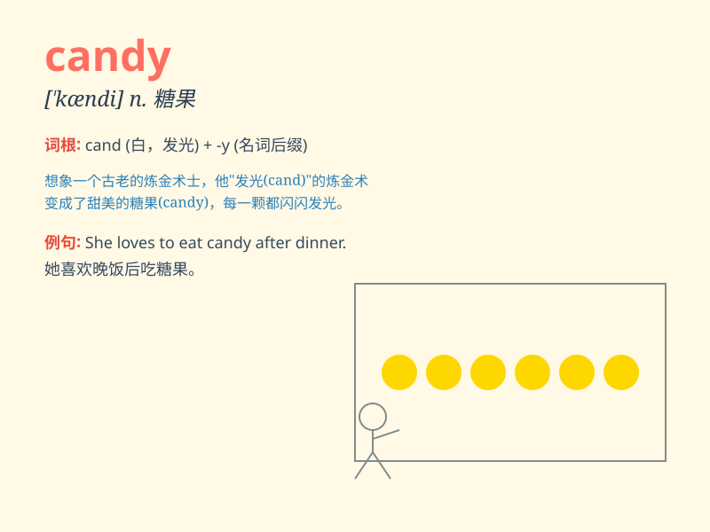

## candy

**英音:** _[\'kændɪ]_ **美音:** _[ˈkændɪ]_

**译义:** *n.糖果,冰糖v.蜜饯,糖煮(水果)*

### 短语

+ **candy bar:** _条形糖果；巧克力棒_

+ **candy store:** _糖果店_

+ **candy cane:** _拐杖糖；圣诞拐杖糖_

+ **candy floss:** _棉花糖_

+ **candy wrapper:** _糖果包装纸_

### 例句

#### 例句1

> **She bought a bag of candies at the store.**

**中文翻译:** 她在商店买了一袋糖果。

**单词释义:** 糖果（复数形式）

#### 例句2

> **The candy tastes sweet.**

**中文翻译:** 这颗糖果尝起来很甜。

**单词释义:** 糖果（单数形式）

#### 例句3

> **He gave her a candy as a gift.**

**中文翻译:** 他给了她一颗糖果作为礼物。

**单词释义:** 糖果（单数形式）

### 背诵小故事

> One day, a little girl was very sad. Then her mother gave her some
colorful candies. The sweet taste made her happy. From then on, whenever
she saw candy, she remembered that happy moment.

**有一天，一个小女孩非常伤心。然后她的妈妈给了她一些五颜六色的糖果。甜甜的味道让她开心起来。从那以后，每当她看到糖果，就会想起那个快乐的时刻。**

### 图义

