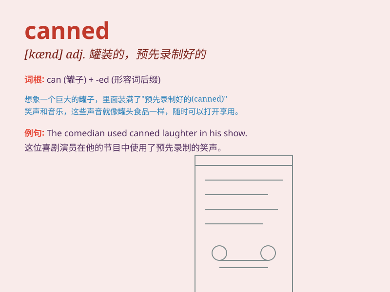

## canned

**英音:** _[kænd]_ **美音:** _[kænd]_

**译义:** *adj.罐装的,录音的,一稿数用的,喝醉了的*

### 短语

+ **canned food:** _罐头食品_

+ **canned laughter:** _预先录制的笑声_

+ **canned fruit:** _罐装水果_

+ **canned music:** _录制的音乐_

+ **canned speech:** _照稿宣读的演讲_

### 例句

#### 例句1

> **I always have some canned food in my pantry for emergencies.**

**中文翻译:** 我的储藏室里总是备有一些罐头食品以备不时之需。

**单词释义:** 罐头的

#### 例句2

> **The speech sounded canned and lacked sincerity.**

**中文翻译:** 讲话听起来很刻板，缺乏诚意。

**单词释义:** 千篇一律的；刻板的

#### 例句3

> **He gave a canned response to the question.**

**中文翻译:** 他对这个问题做出了预先设定的回答。

**单词释义:** 预先准备好的；模式化的

### 背诵小故事

> One day, I went to the supermarket and saw a lot of canned food on
the shelves. The canned fruits and canned fish looked very attractive. I
realized that \'canned\' means food preserved in metal containers.

**有一天，我去超市，看到货架上有很多罐头食品。罐装水果和罐装鱼看起来非常诱人。我明白了'canned'是指保存在金属容器中的食物。**

### 图义

