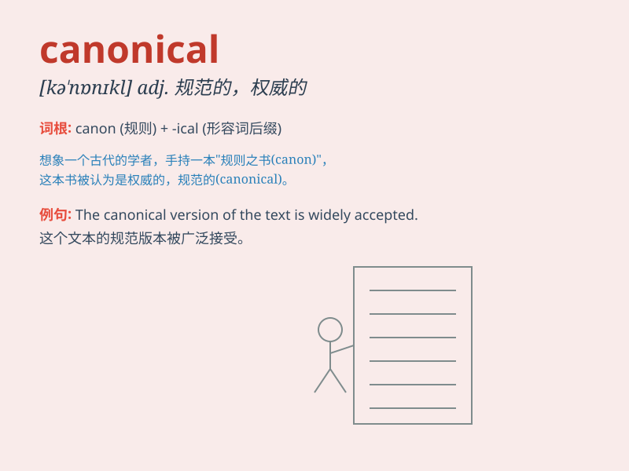

## canonical

**英音:** _[kə\'nɒnɪk(ə)l]_ **美音:** _[kə\'nɑnɪkl]_

**译义:** *adj.规范的*

### 短语

+ **canonical form:** _规范形式；标准型_

+ **canonical ensemble:** _正则系综_

+ **canonical equation:** _典型方程；正则方程_

+ **canonical transformation:** _正则变换_

+ **canonical correlation:** _典型相关_

### 例句

#### 例句1

> **The canonical form of this equation is much simpler.**

**中文翻译:** 这个方程的规范形式要简单得多。

**单词释义:** 标准的；规范的

#### 例句2

> **She followed the canonical rules of the game.**

**中文翻译:** 她遵守游戏的规范规则。

**单词释义:** 规范的；合乎传统的

#### 例句3

> **His behavior was not in accordance with canonical standards.**

**中文翻译:** 他的行为不符合规范标准。

**单词释义:** 标准的；权威的

### 背诵小故事

> In a magical land, there was a unique rulebook called \'Canonical\'.
Everyone followed its teachings precisely. It was like a sacred guide
that determined the right way of doing things. Thus, \'canonical\' means
conforming to a general rule or standard.

**在一个神奇的国度，有一本独特的规则手册叫'Canonical'。每个人都严格遵循它的教导。它就像一个神圣的指南，决定了做事的正确方式。因此，'canonical'意思是符合一般规则或标准。**

### 图义

