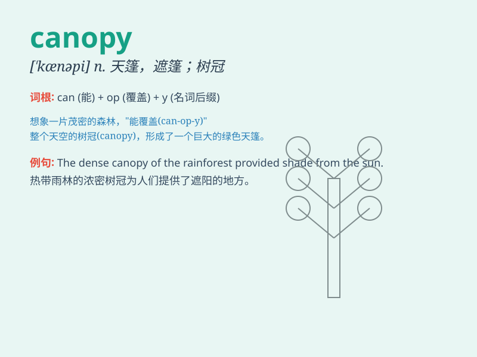

## canopy

**英音:** _[\'kænəpɪ]_ **美音:** _[\'kænəpi]_

**译义:** *n.天篷,遮篷*

### 短语

+ **forest canopy:** _森林树冠层_

+ **canopy bed:** _有篷帐的床_

+ **canopy layer:** _冠层_

+ **tree canopy:** _树冠_

+ **canopy cover:** _林冠覆盖_

### 例句

#### 例句1

> **The forest canopy provided shade from the hot sun.**

**中文翻译:** 森林的树冠遮蔽了炎热的阳光。

**单词释义:** 树冠

#### 例句2

> **The wedding canopy was decorated with beautiful flowers.**

**中文翻译:** 婚礼的天篷装饰着美丽的花朵。

**单词释义:** 华盖

#### 例句3

> **The airplane\'s canopy was cracked during the flight.**

**中文翻译:** 飞机的座舱盖在飞行过程中破裂。

**单词释义:** 座舱盖

### 背诵小故事

> A monkey was swinging through the forest. It jumped onto a big
branch. Above it was a beautiful canopy of leaves that protected it from
the hot sun. The monkey felt safe and cool under the canopy.

**一只猴子在森林里荡来荡去。它跳到一根大树枝上。在它上方是一个美丽的树冠，为它遮挡炎热的阳光。猴子在树冠下感到安全又凉爽。**

### 图义

