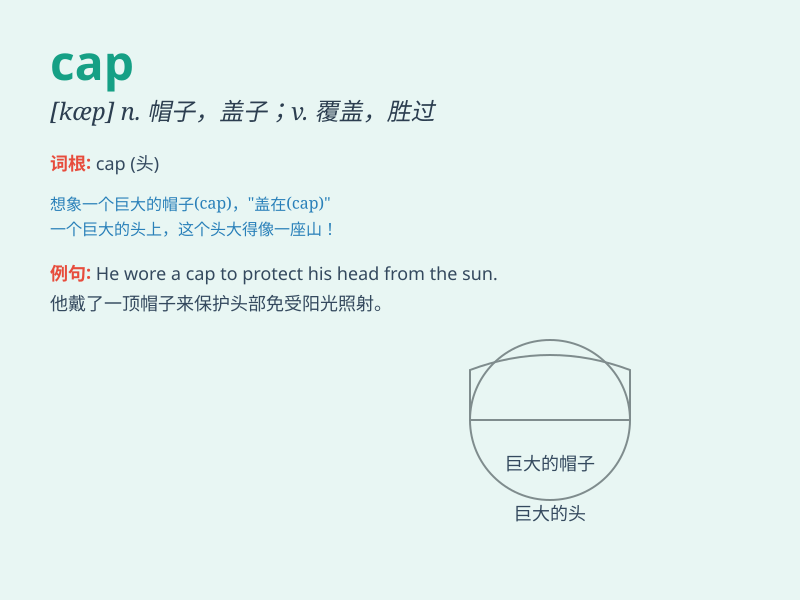

## cap

**英音:** _[kæp]_ **美音:** _[kæp]_

**译义:**
*n.帽子,军帽,(瓶)帽,(笔)帽;vt.戴帽子,盖在\...顶上;carrierless amplitude
and phase,相幅载波*

### 短语

+ **baseball cap:** _棒球帽_

+ **swimming cap:** _游泳帽_

+ **cap and gown:** _方帽长袍（毕业典礼等场合穿的服装）_

+ **put a cap on:** _限制；控制_

+ **cap off:** _使达到高潮；结束_

### 例句

#### 例句1

> **She wore a red cap to protect her from the sun.**

**中文翻译:** 她戴着一顶红色帽子来防晒。

**单词释义:** 帽子

#### 例句2

> **The bottle cap was difficult to open.**

**中文翻译:** 瓶盖很难打开。

**单词释义:** 盖子；帽

#### 例句3

> **The government has imposed a cap on borrowing.**

**中文翻译:** 政府对借贷施加了上限。

**单词释义:** 上限；限额

### 背诵小故事

> A little mouse was running around with a small cap on its head. It
looked so funny. But the cap was too big and kept falling off. Finally,
the mouse found a cap that fit perfectly.

**一只小老鼠头上戴着一顶小帽子跑来跑去。它看起来很滑稽。但帽子太大了，老是掉下来。最后，老鼠找到了一顶非常合适的帽子。**

### 图义

