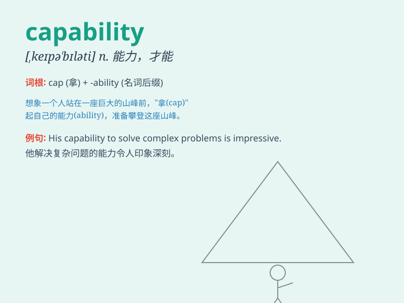

## capability

**英音:** _[ˌkeɪpəˈbɪləti]_ **美音:** _[ˌkepəˈbɪlətɪ]_

**译义:** *n.(实际)能力,性能,容量,接受力*

### 短语

+ **capability assessment:** _能力评估_

+ **core capability:** _核心能力_

+ **technical capability:** _技术能力_

+ **operational capability:** _运营能力_

+ **capability building:** _能力建设_

### 例句

#### 例句1

> **The new software has enhanced the capability of the system to
handle large amounts of data.**

**中文翻译:** 新软件增强了系统处理大量数据的能力。

**单词释义:** 能力；才能

#### 例句2

> **She has the capability to become a great leader.**

**中文翻译:** 她有能力成为一名伟大的领导者。

**单词释义:** 能力；潜力

#### 例句3

> **The machine\'s capability is limited by its design.**

**中文翻译:** 机器的功能受到其设计的限制。

**单词释义:** 性能；功能

### 背诵小故事

> A brave adventurer was exploring a mysterious cave. He needed the
capability to climb, swim and solve puzzles. With his skills and
determination, he finally found the treasure. The word \'capability\'
means the ability or power to do something.

**一位勇敢的探险家正在探索一个神秘的洞穴。他需要具备攀爬、游泳和解决谜题的能力。凭借他的技能和决心，他最终找到了宝藏。单词\'capability\'意思是做某事的能力或本领。**

### 图义

