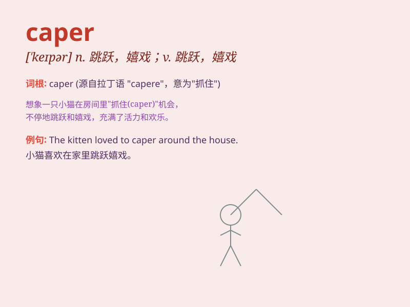

## caper

**英音:** _[\'keɪpə]_ **美音:** _[\'kepɚ]_

**译义:** *n.跳跃vi.雀跃*

### 短语

+ **cut a caper:** _欢蹦乱跳；嬉戏_

+ **caper sauce:** _刺山柑酱_

+ **caper bush:** _刺山柑；老鼠瓜_

+ **pull a caper:** _做出愚蠢的举动_

+ **caper about:** _蹦蹦跳跳；到处乱跑_

### 例句

#### 例句1

> **The children were having a caper in the garden.**

**中文翻译:** 孩子们正在花园里嬉闹。

**单词释义:** 嬉戏，欢蹦乱跳

#### 例句2

> **He got arrested for his latest caper.**

**中文翻译:** 他因最近的胡作非为而被捕。

**单词释义:** 冒险行为，恶作剧

#### 例句3

> **The thief\'s caper was foiled by the police.**

**中文翻译:** 小偷的阴谋被警察挫败了。

**单词释义:** 诡计，花招

### 背诵小故事

> A thief planned a caper to steal jewels from a rich mansion. But in
the end, he was caught. Remember, caper means a playful or mischievous
adventure or escapade.

**一个小偷计划了一场恶作剧，想从一座富有的宅邸偷珠宝。但最后，他被抓住了。记住，caper
意思是嬉戏的或恶作剧式的冒险或越轨行为。**

### 图义

