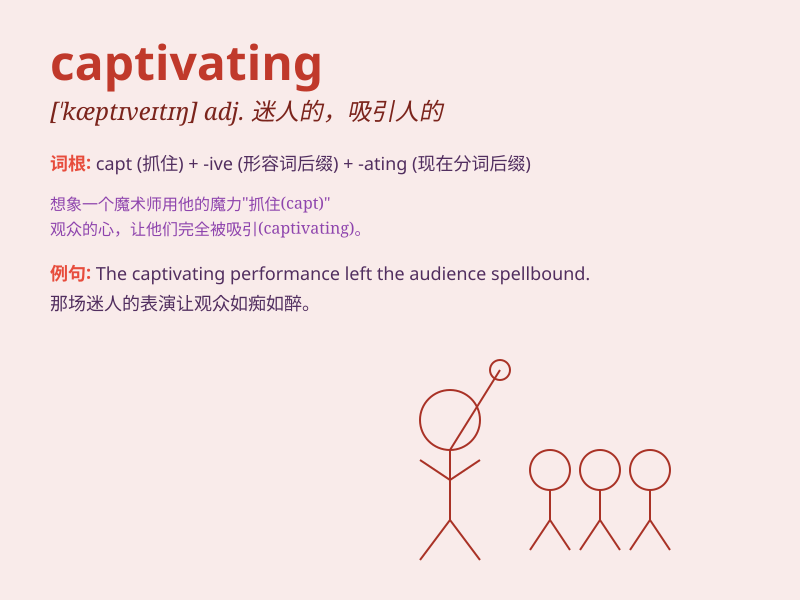

## captivating

**英音:** _[ˈkæptɪveɪtɪŋ]_ **美音:** _[ˈkæptɪveɪtɪŋ]_

**译义:** *adj.迷人的,有魅力的*

### 短语

+ **captivating charm:** _迷人的魅力_

+ **captivating smile:** _迷人的微笑_

+ **captivating story:** _迷人的故事_

+ **captivating performance:** _迷人的表演_

+ **captivating personality:** _迷人的个性_

### 例句

#### 例句1

> **The captivating story kept the children engaged for hours.**

**中文翻译:** 这个迷人的故事让孩子们专注了好几个小时。

**单词释义:** 迷人的

#### 例句2

> **She has a captivating smile that lights up the room.**

**中文翻译:** 她有一个迷人的微笑，能照亮整个房间。

**单词释义:** 迷人的

#### 例句3

> **The captivating scenery of the mountains left us speechless.**

**中文翻译:** 山脉的迷人景色让我们惊叹得说不出话来。

**单词释义:** 迷人的

### 背诵小故事

> A fairy in the forest had a captivating smile. Everyone who saw it
was charmed and couldn\'t look away. Her smile was so enchanting that it
made people forget all their troubles. Just like this word means
charming and attractive.

**森林里的一位仙女有着迷人的微笑。每个看到的人都被迷住了，无法移开视线。她的微笑如此迷人，让人们忘却了所有烦恼。正如这个单词captivating所表示的：迷人的，有吸引力的。**

### 图义

