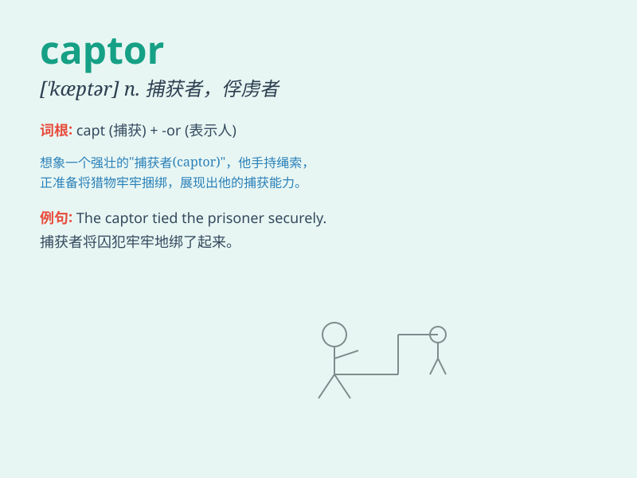

## captor

**英音:** _[\'kæptə]_ **美音:** _[\'kæptɚ]_

**译义:** *n.捕捉者,逮捕者,捕快*

### 短语

+ **Hostage captor:** _人质劫持者_

+ **Animal captor:** _动物捕获者_

+ **Enemy captor:** _敌人捕获者_

+ **Prisoner captor:** _囚犯抓捕者_

+ **Rebel captor:** _叛军抓捕者_

### 例句

#### 例句1

> **The captor held the hostage for several days.**

**中文翻译:** 劫持者将人质扣押了好几天。

**单词释义:** 劫持者；捕捉者

#### 例句2

> **The captor demanded a ransom for the release of the prisoner.**

**中文翻译:** 捕获者要求为释放囚犯支付赎金。

**单词释义:** 捕获者；抓捕者

#### 例句3

> **The bird struggled to escape from the captor\'s net.**

**中文翻译:** 这只鸟挣扎着从捕捉者的网中逃脱。

**单词释义:** 捕捉者

### 背诵小故事

> A brave knight was on a quest. One day, he caught a thief who had
been stealing from the villagers. The knight became the captor of the
thief. He took the thief to the king for justice.

**一位勇敢的骑士正在执行任务。有一天，他抓住了一个一直从村民那里偷东西的小偷。骑士成了小偷的捕获者。他把小偷带到国王那里接受审判。**

### 图义

