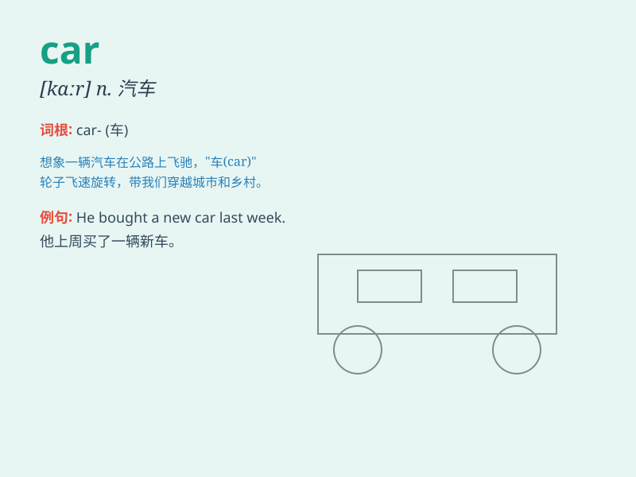

## car

**英音:** _[kɑː]_ **美音:** _[kɑr]_

**译义:** *n.汽车,小汽车,车辆,客车,[铁]车厢*

### 短语

+ **by car:** _乘汽车_

+ **car accident:** _车祸；交通事故_

+ **car park:** _停车场_

+ **passenger car:** _客车；乘用车_

+ **racing car:** _赛车_

### 例句

#### 例句1

> **I need to buy a new car.**

**中文翻译:** 我需要买一辆新车。

**单词释义:** 汽车

#### 例句2

> **The car broke down on the highway.**

**中文翻译:** 这辆车在高速公路上抛锚了。

**单词释义:** 汽车

#### 例句3

> **He drives a red car to work every day.**

**中文翻译:** 他每天开一辆红色的汽车去上班。

**单词释义:** 汽车

### 背诵小故事

> One day, a little boy was playing in the park. Suddenly, a shiny car
passed by with a loud honk. The boy was so amazed by the car\'s speed
and beauty. From then on, he dreamed of having a car of his own one day.

**一天，一个小男孩在公园玩耍。突然，一辆闪亮的汽车响着喇叭驶过。男孩对汽车的速度和美丽感到十分惊奇。从那以后，他梦想有一天能拥有一辆属于自己的汽车。**

### 图义

