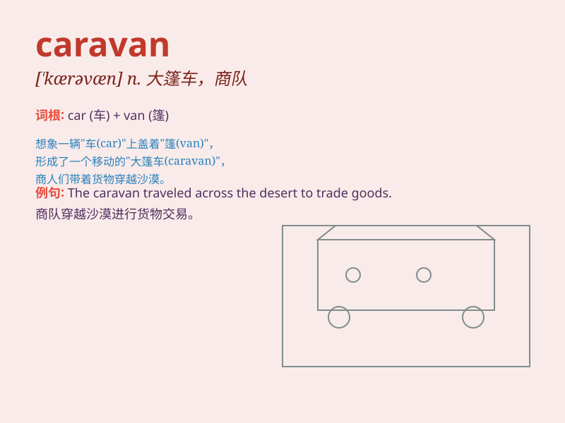

## caravan

**英音:** _[\'kærəvæn; kærə\'væn]_ **美音:**
_[\'kærəvæn]_

**译义:**
*n.(商队,游客经过沙漠时为安全起见而结队同行的)沙漠,旅行队,大篷车*

### 短语

+ **caravan park:** _旅行车停车场；大篷车营地_

+ **caravan site:** _旅行车宿营地；大篷车营地_

+ **join a caravan:** _加入旅行车队_

+ **caravan holiday:** _乘旅行车度假_

+ **caravan trip:** _旅行车旅行_

### 例句

#### 例句1

> **We spent our vacation in a caravan by the sea.**

**中文翻译:** 我们在海边的一辆旅行拖车里度假。

**单词释义:** 旅行拖车

#### 例句2

> **A caravan of camels crossed the desert.**

**中文翻译:** 一队骆驼穿过了沙漠。

**单词释义:** （尤指穿越沙漠的）旅行队；大篷车队

#### 例句3

> **The caravan was attacked by bandits on the way.**

**中文翻译:** 大篷车队在路上遭到了强盗的袭击。

**单词释义:** 大篷车队

### 背诵小故事

> A family decided to go on a vacation. They loaded all their stuff
into a caravan and set off. The caravan was like a small home on wheels,
taking them to beautiful places. They had a great time in the caravan.

**一家人决定去度假。他们把所有东西装进一辆大篷车然后出发。大篷车就像一个带轮子的小家，带他们去了美丽的地方。他们在大篷车里度过了愉快的时光。**

### 图义

