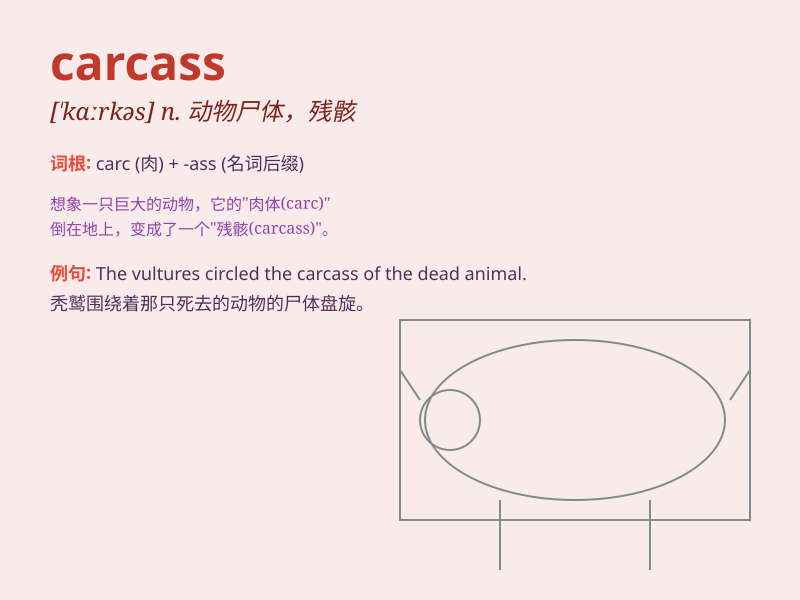

## carcass

**英音:** _[ˈkɑːkəs]_ **美音:** _[ˈkɑːrkəs]_

**译义:** *n.(屠宰后)畜体*

### 短语

+ **animal carcass:** _动物尸体_

+ **decomposing carcass:** _腐烂的尸体_

+ **carcass disposal:** _尸体处理_

+ **carcass inspection:** _尸体检查_

+ **bird carcass:** _鸟的尸体_

### 例句

#### 例句1

> **The vultures were circling around the carcass of the dead
animal.**

**中文翻译:** 秃鹫在动物尸体周围盘旋。

**单词释义:** 尸体

#### 例句2

> **They found the carcass of a deer in the forest.**

**中文翻译:** 他们在森林里发现了一头鹿的尸体。

**单词释义:** 尸体

#### 例句3

> **The carcass of the old building was still standing after the
fire.**

**中文翻译:** 火灾发生后，旧建筑的残骸仍然矗立着。

**单词释义:** 残骸

### 背诵小故事

> One day, while hiking in the forest, I came across a carcass of a
deer. It was a sad sight. The carcass was left there, a reminder of the
cycle of life and death.

**有一天，在森林里徒步时，我碰到了一头鹿的尸体。这是一幅悲伤的景象。这具尸体留在那里，提醒着我生命与死亡的循环。**

### 图义

