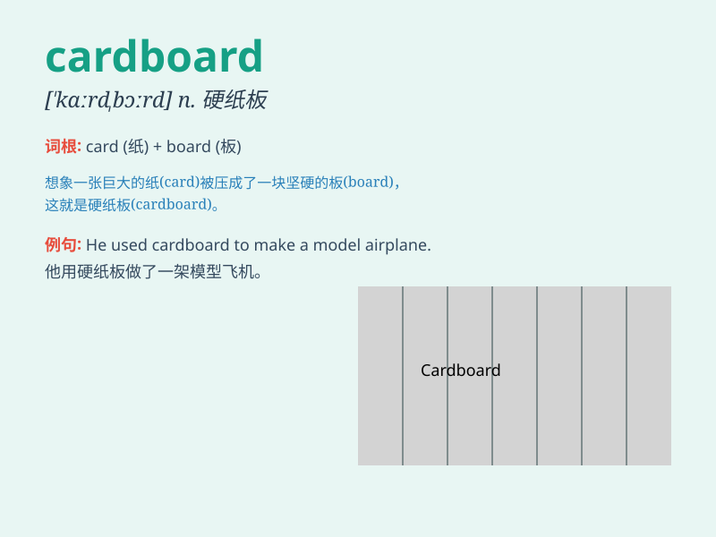

## cardboard

**英音:** _[\'kɑːdbɔːd]_ **美音:** _[\'kɑrdbɔrd]_

**译义:** *n.纸板*

### 短语

+ **cardboard box:** _纸板箱_

+ **cardboard cutout:** _硬纸板人像_

+ **cardboard figure:** _纸板人物_

+ **cardboard packaging:** _纸板包装_

+ **cardboard model:** _纸板模型_

### 例句

#### 例句1

> **The box is made of cardboard.**

**中文翻译:** 盒子是用纸板做的。

**单词释义:** 纸板

#### 例句2

> **He was carrying a cardboard sign.**

**中文翻译:** 他拿着一个纸板牌子。

**单词释义:** 硬纸板

#### 例句3

> **The stage set was made of cardboard and paint.**

**中文翻译:** 舞台布景由纸板和油漆制成。

**单词释义:** 纸板

### 背诵小故事

> One day, a little mouse was looking for a warm place. It found a big
box made of cardboard. It decided to make a home in it. The cardboard
was thick and could protect it from the cold.

**一天，一只小老鼠正在寻找一个温暖的地方。它发现了一个由硬纸板做成的大盒子。它决定在里面安家。硬纸板很厚，可以保护它抵御寒冷。**

### 图义

