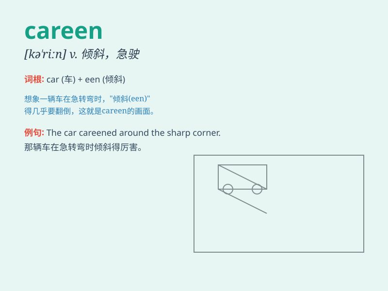

## careen

**英音:** _[kə\'riːn]_ **美音:** _[kə\'rin]_

**译义:** *vt.倾斜,倾,(为修理或清洁而)使倾侧n.船的倾侧*

### 短语

+ **careen off:** _（车辆等）突然转向并偏离_

+ **careen around:** _（人或物）急速旋转，四处乱冲_

+ **careen into:** _（失控地）猛撞进_

+ **careen along:** _（车辆等）沿着（道路等）急速行驶_

+ **careen out of control:** _失控地倾斜，失去控制地猛冲_

### 例句

#### 例句1

> **The car careened around the corner at high speed.**

**中文翻译:** 汽车高速驶过拐角。

**单词释义:** （车辆）失控地猛冲，疾驶

#### 例句2

> **The ship careened dangerously in the storm.**

**中文翻译:** 船在暴风雨中危险地倾斜。

**单词释义:** （船）倾斜，歪斜

#### 例句3

> **He careened down the hill on his bike.**

**中文翻译:** 他骑着自行车冲下山。

**单词释义:** 猛冲，疾冲

### 背诵小故事

> 想象一下，在一条崎岖的山路上，一辆失控的赛车 careen
着冲了下来。它左右摇晃，速度极快，完全失去了控制。就像这个单词 careen
所表达的那样，（意为：（失控地）猛冲，疾驶）

**想象在山路上失控猛冲的赛车来辅助记忆 careen
这个单词，意为（失控地）猛冲，疾驶**

### 图义

