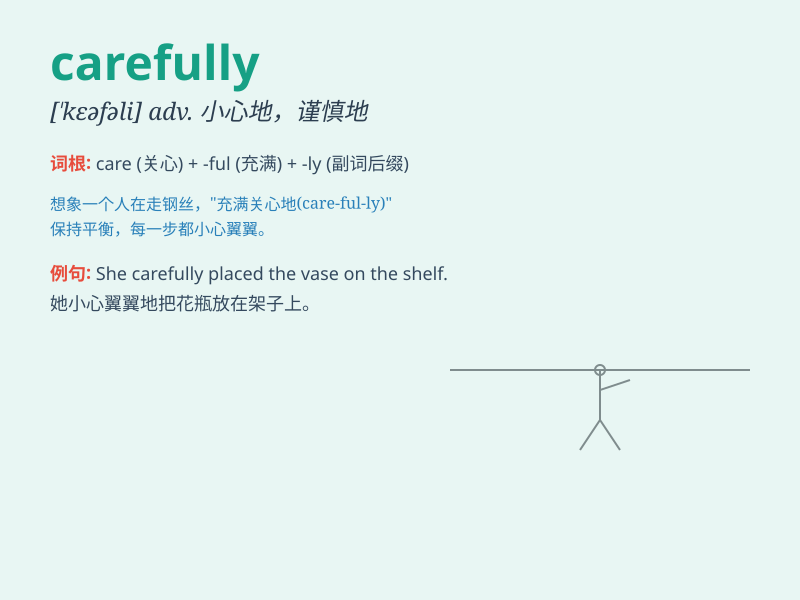

## carefully

**英音:** _[\'keəfəlɪ]_ **美音:** _[\'kɛrfəli]_

**译义:** *adv.小心地,谨慎地*

### 短语

+ **be carefully:** _小心；谨慎_

+ **handle carefully:** _小心处理_

+ **drive carefully:** _小心驾驶_

+ **walk carefully:** _小心走路_

+ **listen carefully:** _仔细倾听_

### 例句

#### 例句1

> **She carefully read the instructions before starting the
experiment.**

**中文翻译:** 在开始实验之前，她仔细阅读了说明。

**单词释义:** 仔细地

#### 例句2

> **He drives carefully to avoid accidents.**

**中文翻译:** 他小心驾驶以避免发生事故。

**单词释义:** 小心地

#### 例句3

> **The doctor carefully examined the patient.**

**中文翻译:** 医生仔细地检查了病人。

**单词释义:** 仔细地

### 背诵小故事

> One day, a little monkey was crossing a river carefully. It stepped
on the stones one by one, looking around constantly to make sure it was
safe. Finally, it reached the other side safely. The little monkey was
so careful!

**有一天，一只小猴子小心翼翼地过河。它一块石头一块石头地踩过去，不停地四处张望以确保安全。最后，它安全地到达了对岸。这只小猴子真小心！**

### 图义

