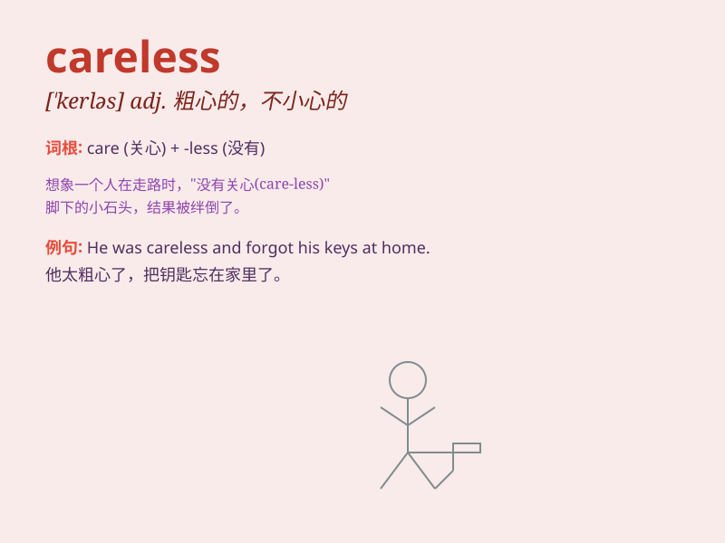

## careless

**英音:** _[\'keələs]_ **美音:** _[\'kɛrləs]_

**译义:** *adj.粗心的,疏忽的*

### 短语

+ **careless mistake:** _粗心的错误_

+ **careless driving:** _粗心驾驶_

+ **careless attitude:** _粗心大意的态度_

+ **careless behavior:** _粗心的行为_

+ **careless worker:** _粗心的工人_

### 例句

#### 例句1

> **He is always so careless when doing his homework and makes many
mistakes.**

**中文翻译:** 他做作业时总是那么粗心，犯了很多错误。

**单词释义:** 粗心的

#### 例句2

> **The careless driver caused a serious accident.**

**中文翻译:** 粗心的司机造成了一场严重的事故。

**单词释义:** 粗心大意的

#### 例句3

> **Her careless attitude towards her health worried her parents.**

**中文翻译:** 她对自己健康的粗心态度让她的父母担心。

**单词释义:** 漫不经心的

### 背诵小故事

> One day, Tom was so careless that he left his keys at home and locked
himself out. When he realized his mistake, he was very frustrated. This
shows what can happen when you are careless.

**有一天，汤姆非常粗心，他把钥匙落在家里，把自己锁在了外面。当他意识到自己的错误时，他非常沮丧。这表明了粗心会带来什么样的后果。**

### 图义

