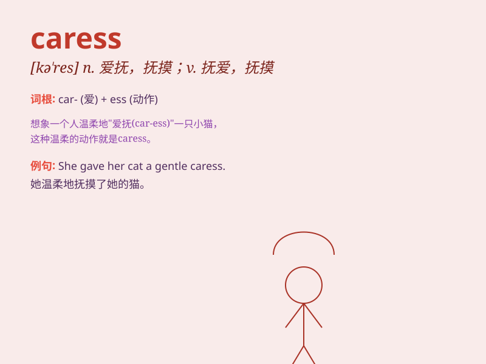

## caress

**英音:** _[kə\'res]_ **美音:** _[kə\'rɛs]_

**译义:** *n.爱抚,接吻vt.抚爱*

### 短语

+ **gentle caress:** _温柔的抚摸_

+ **loving caress:** _充满爱意的抚摸_

+ **tender caress:** _轻柔的爱抚_

+ **mother\'s caress:** _母亲的爱抚_

+ **caress affectionately:** _深情地抚摸_

### 例句

#### 例句1

> **He gently caressed her cheek.**

**中文翻译:** 他温柔地抚摸着她的脸颊。

**单词释义:** 抚摸

#### 例句2

> **The wind caressed the leaves of the trees.**

**中文翻译:** 风轻抚着树叶。

**单词释义:** 轻抚

#### 例句3

> **She caressed the soft fabric of the dress.**

**中文翻译:** 她抚摸着裙子柔软的布料。

**单词释义:** 抚摸

### 背诵小故事

> A little girl was sad. Her father came and gently caressed her head
to comfort her. The soft touch made her feel loved. Remember, \'caress\'
means to touch gently and lovingly.

**一个小女孩很伤心。她的父亲走过来，轻轻地抚摸她的头安慰她。这种轻柔的触碰让她感到被爱。记住，'caress'意思是温柔且充满爱意地抚摸。**

### 图义

