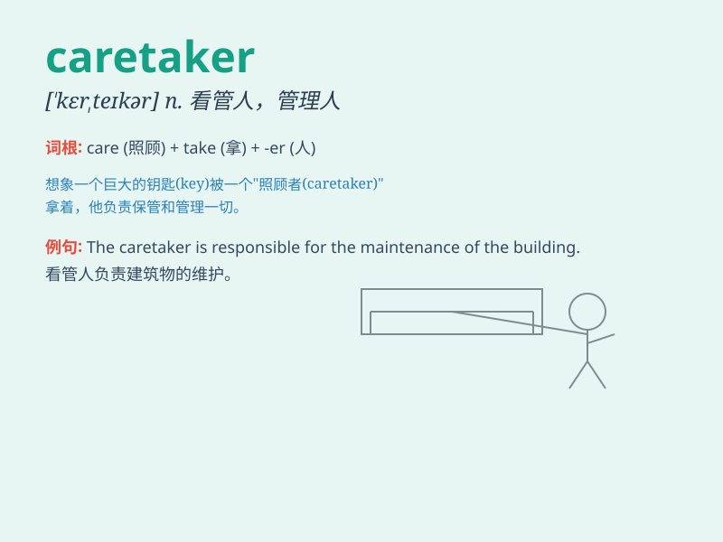

## caretaker

**英音:** _[\'keəteɪkə]_ **美音:** _[\'kɛr\'tekɚ]_

**译义:** *n.管理者,看管者,看守者*

### 短语

+ **caretaker government:** _看守政府；过渡政府_

+ **caretaker manager:** _临时经理_

+ **caretaker job:** _临时工作；看管工作_

+ **caretaker period:** _看守时期；过渡时期_

+ **caretaker staff:** _看管人员；临时工作人员_

### 例句

#### 例句1

> **The caretaker of the old house makes sure everything is in
order.**

**中文翻译:** 老房子的看门人确保一切都井然有序。

**单词释义:** 看管人

#### 例句2

> **The school caretaker is responsible for the cleanliness of the
campus.**

**中文翻译:** 学校管理员负责校园的清洁。

**单词释义:** 管理员

#### 例句3

> **She works as a caretaker in the local park.**

**中文翻译:** 她在当地公园担任管理员。

**单词释义:** 管理员；看守人

### 背诵小故事

> A young man was hired as a caretaker for an old mansion. He cared for
the place carefully, looking after every detail. One day, the owner
returned and praised him for being a wonderful caretaker.

**一个年轻人被雇为一座古老宅邸的管理员。他小心翼翼地照管着这个地方，留意每个细节。有一天，主人回来并称赞他是一位出色的管理员。**

### 图义

